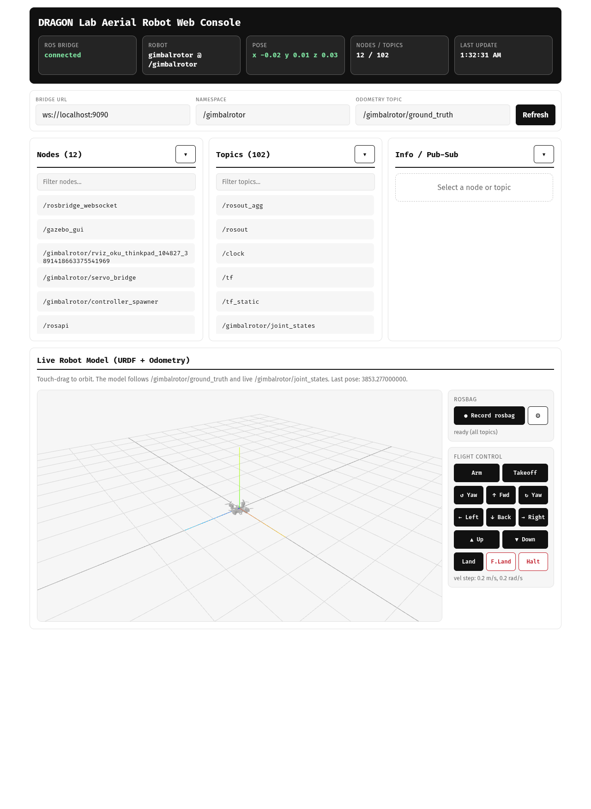
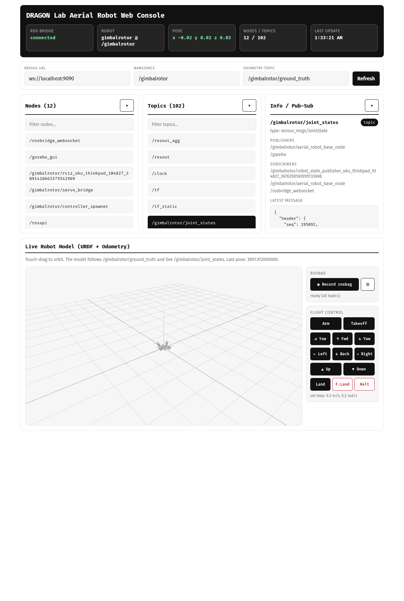
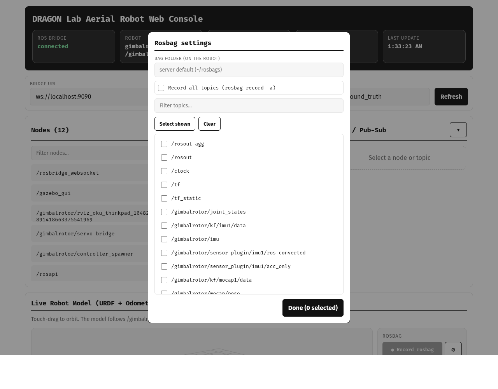
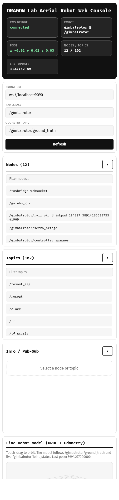
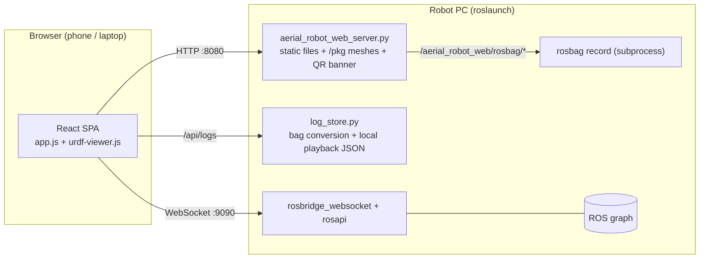

# aerial_robot_web

**DRAGON Lab Aerial Robot Web Console** — a mobile-first web UI shared by all aerial robot
bringup launches. It serves a static React single-page application from a ROS node and talks
to the robot through `rosbridge_server`, so a phone, tablet, or laptop browser can inspect
the ROS graph, watch the robot model move, record rosbags, and send teleop commands —
it can also replay ROS 1 bags and export selected motion as standard media files.
**No client app install is required; use `roslaunch` and a browser.**



## Quick start

```bash
# one-time dependency install (all available via apt / rosdep, no pip required)
sudo apt install ros-one-rosbridge-server python3-rospkg python3-qrcode
```

Enable the console from any robot bringup (it is **disabled by default**):

```bash
roslaunch dragon bringup.launch web:=true
```

The longer `launch_web_console:=true` argument is still accepted for compatibility.

or launch it standalone:

```bash
roslaunch aerial_robot_web web_console.launch robot_ns:=dragon robot_type:=dragon
```

Near the end of the launch output (after `banner_delay`, default 8 s) the console prints its
URLs and a QR code — scan it from a phone on the robot network:

```text
============================================================
 DRAGON Lab Aerial Robot Web Console
------------------------------------------------------------
 Local browser : http://localhost:8080?robot_ns=dragon&...
 Phone / LAN   : http://192.168.0.10:8080?robot_ns=dragon&...
------------------------------------------------------------
 Scan this QR code from a phone on the robot network:
   ▄▄▄▄▄▄▄ ▄  ▄▄ ▄▄▄▄▄▄▄
   █ ▄▄▄ █ ▀▄█▀▄ █ ▄▄▄ █   (compact half-block QR)
   █▄▄▄▄▄█ ▄▀▄ ▀ █▄▄▄▄▄█
============================================================
```

## UI tour

### Graph inspection & topic publishing



- **Nodes / Topics** cards list the live graph via `rosapi`, each with its own
  case-insensitive filter and a collapse toggle (`▾` / `▸`) that shrinks the card to its
  title bar.
- Selecting a topic shows its **type, publishers, subscribers, and a throttled live message
  preview** in the Info card; selecting a node shows its publications, subscriptions, and
  services.
- The **Publish box** below the topic info is pre-filled with a JSON template generated from
  the topic's message type (`rosapi/message_details`), so you can edit values and publish
  through rosbridge immediately.

### Rosbag recording



- **● Record rosbag** starts `rosbag record -a` on the robot right away; the button turns
  into **■ Stop recording** while a bag is being written.
- The **⚙ gear** opens the settings popup where you can switch from *all topics* to a
  checked subset (with filter / select-shown / clear helpers) and set the **bag folder on
  the robot**. Settings persist in the browser (localStorage).
- Bags are saved as `web_console_<timestamp>.bag` under `rosbag_dir`
  (default `$HOME/rosbags`, falling back to `/tmp/rosbags` when `HOME` is unset).
  Control flows over `/aerial_robot_web/rosbag/{start,stop,status}`; the latched status
  topic restores the recording state after a page reload.

### Log replay and media export

The **Log Replay** tab imports a ROS 1 `.bag`, extracts bounded browser-oriented samples,
and synchronizes the following views on one playback clock:

- robot base pose and joint motion in the Three.js URDF viewer;
- numeric time-series selected from recorded topics;
- flight-state, failsafe, gate-rejection, and explicit event transitions.

Use the **IN/OUT** controls or the Start/End fields to select an interval. **Export video**
downloads that interval as MP4 when the browser advertises MP4 `MediaRecorder` support, or
as GIF through the browser-side `gifenc` encoder. **PNG** and **JPEG** save the currently
displayed 3D frame. Exported files are generated in the browser and downloaded to the
operator's device; the console does not create a share URL or upload exported media.

Converted playback JSON is stored locally under `log_dir`. By default the uploaded source
bag is deleted as soon as conversion finishes; set `log_keep_bag:=true` only when retaining
another copy is intentional. Imported logs can be removed with **Delete local data**.

### Live robot model & flight control

The **Live Robot Model (URDF + Odometry)** panel renders the robot URDF with Three.js,
driven by the live `joint_states` and the odometry pose topic — a lightweight Gazebo-style
pose viewer in the browser (touch-drag to orbit). `package://` meshes are served by the
console itself under `/pkg/<package>/<path>`.

The **Flight Control** pad next to the viewer mirrors
`aerial_robot_base/scripts/keyboard_command.py`:

| Button | Topic | Message |
| --- | --- | --- |
| Arm / Takeoff / Land / F.Land / Halt | `<robot_ns>/teleop_command/{start,takeoff,land,force_landing,halt}` | `std_msgs/Empty` |
| ↑↓←→ / ▲▼ / ↺↻ velocity nudges (0.2 m/s, 0.2 rad/s) | `<robot_ns>/uav/nav` | `aerial_robot_msgs/FlightNav` (VEL_MODE) |

### Mobile layout



The layout collapses to a single column on phones, with touch-sized buttons and
safe-area-aware padding.

## Launch arguments

| Argument | Default | Description |
| --- | --- | --- |
| `robot_ns` | `""` | Robot namespace shown in the UI and used for teleop/URDF topics |
| `robot_type` | `generic` | Robot label shown in the header |
| `pose_topic` | `/<robot_ns>/ground_truth` | `nav_msgs/Odometry` topic that moves the URDF model. For estimator output use e.g. `/<robot_ns>/uav/baselink/odom` |
| `web_port` | `8080` | HTTP port of the console |
| `rosbridge_port` | `9090` | rosbridge websocket port |
| `launch_rosbridge` | `true` | Disable when another rosbridge is already running |
| `rosbridge_output` | `log` | Set to `screen` when debugging rosbridge itself |
| `auto_install_qr_dependency` | `true` | Try `sudo -n apt-get install python3-qrcode`, then `pip --user`, when QR support is missing (never waits for a sudo password; QR is optional either way) |
| `banner_delay` | `8.0` | Seconds to delay the URL/QR banner so it lands near the end of the launch output |
| `rosbag_dir` | `$(optenv HOME /tmp)/rosbags` | Where browser-triggered rosbags are saved |
| `log_dir` | `$(optenv HOME /tmp)/.aerial_robot_web/logs` | Local directory for converted playback data |
| `log_max_upload_gb` | `5.0` | Maximum accepted ROS bag size in GiB |
| `log_max_samples_per_topic` | `2000` | Per-topic sample bound used during conversion |
| `log_keep_bag` | `false` | Retain the imported source bag after conversion |

## Architecture



## Limitations

- React, roslib, and Three.js are loaded from a CDN, so the **browser** needs internet
  access at least once to cache them (the robot itself does not). On a fully offline robot
  LAN the console shows a static notice instead of the interface.
- GIF export loads [`gifenc`](https://github.com/mattdesl/gifenc) from a pinned CDN URL when first used. MP4 availability depends
  on the browser's native `MediaRecorder` MP4 support; unsupported browsers show an error
  and can still use GIF or PNG/JPEG export.
- GIF export is limited to 60 seconds per file to bound browser memory and CPU use.
- The terminal QR code needs `python3-qrcode`; without it the console still works and only
  the QR is skipped.
