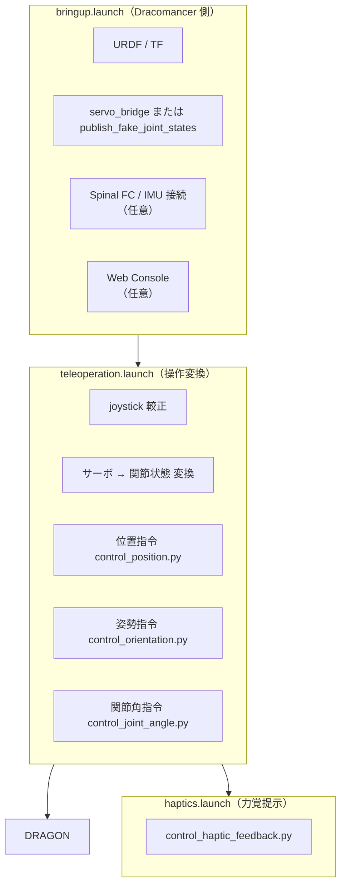
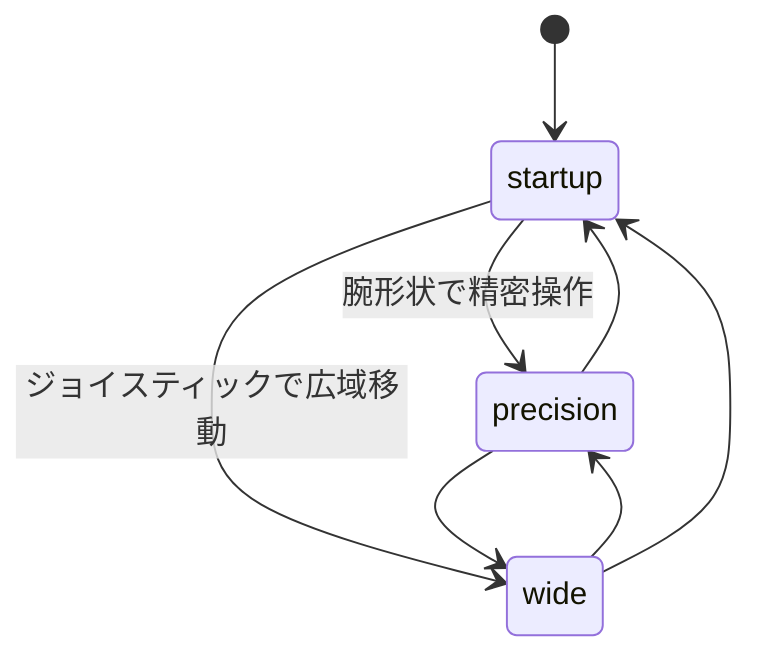
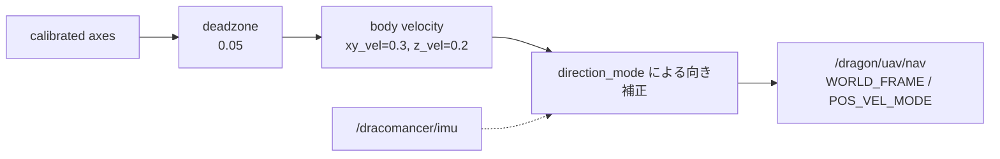
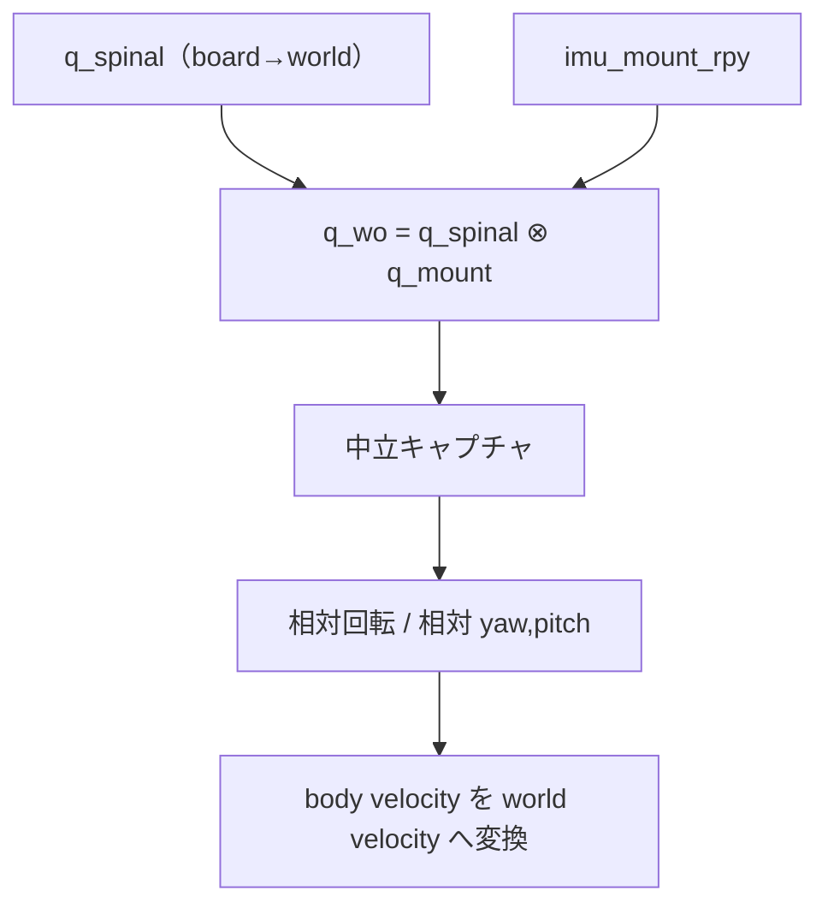
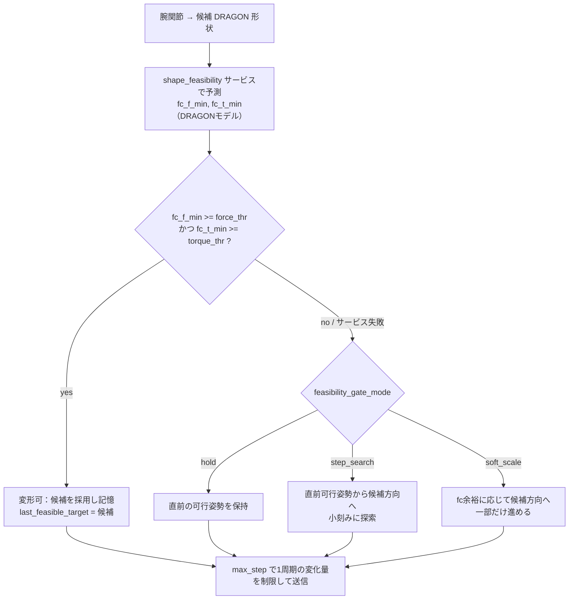

# Dracomancer

このドキュメントは、Dracomancer の現在の実装に基づくシステム仕様をまとめたものです。
Dracomancer は、オペレータの腕に装着する上肢外骨格型遠隔操作デバイスであり、現状では主に DRAGON の移動指令と形状指令を生成します。

> 現状の実装メモ: `src/` 以下の C++ ファイルはプレースホルダで、実際の処理は `scripts/` 配下の Python ノードが担っています。力覚提示は安全スケーリングで抑制された形状入力から提示トルク相当量を計算しますが、Mk-I の XL430-W250-T では個々のサーボへ所望電流・所望トルクを入力できないため、Mk-I の既定実機出力はトルク ON/OFF です。互換サーボ向けの電流指令経路は残しています。最適化ベースの本格的な姿勢制限は未実装です。

## 全体構成

Dracomancer は、デバイス自身の起動と DRAGON への遠隔操作変換を launch 単位で分けています。



主なノード構成:

| ノード | 役割 | 主な入力 | 主な出力 |
| --- | --- | --- | --- |
| `calibrate_joystick.py` | 操縦桿の生値を較正して正規化 | `/joystick/raw` | `/dracomancer/joystick/calibrated` |
| `convert_servo_to_joint_states.py` | サーボtickをラジアンの関節状態へ変換 | `/dracomancer/servo/states` | `/dracomancer/joint_states` |
| `control_position.py` | 操縦桿とIMUから DRAGON の速度指令を生成 | joystick, IMU, flight_state | `/dragon/uav/nav` |
| `control_orientation.py` | 操縦桿から姿勢指令を生成 | joystick, flight_state | `/dragon/final_target_baselink_rpy` |
| `control_joint_angle.py` | 腕関節から DRAGON の形状指令を生成（候補姿勢のフィージビリティで変形可否を判定） | joint_states, shape_feasibility, threshold, flight_state | `/dragon/joints_ctrl`, `/dracomancer/shape_control_error` |
| `shape_feasibility_node`（C++） | 候補リンク角の force/torque volume 半径を DRAGON モデルで予測するサービス | candidate joints | `~check_shape`（fc_f_min, fc_t_min） |
| `volume_radius_monitor.py` | しきい値 pub/sub・ライブ安全スケール算出（bringup.launch で常時起動。fc 内接半径は再 pub しない） | fc inradius, threshold cmd | `*_volume_radius_threshold`, `/dracomancer/dragon_shape_safety_scale` |
| `control_haptic_feedback.py` | 抑制された形状入力から提示トルク相当量を計算し、既定でサーボのトルク ON/OFF を出力し、互換サーボ向けには電流指令も任意出力 | joint_states, shape_control_error, mode | `/dracomancer/haptic_torque`, `/servo/torque_enable`, `/servo/target_current` |
| `publish_fake_joint_states.py` | 実機なしで Dracomancer 関節状態を生成 | `/dracomancer/joint_cmd` | `/dracomancer/joint_states` |

デバイス側ハードウェア:

- 腕関節サーボは ID 0-6 の 7 個（肩・上腕・肘・手首）。
- サーボ状態は Spinal / FC 経由で `/dracomancer/servo/states` として扱います。
- 背中部 IMU は `/dracomancer/imu` として、操作者相対の移動方向補正に使います。
- M5Stack / 操縦桿は `/joystick/raw` の入力元です。

## テレオペレーションのデータフロー

Dracomancer から DRAGON への指令は、位置系統と形状系統の2つに分かれます。

```mermaid
flowchart TB
    subgraph POSE["位置系統（操縦桿 → 機体移動）"]
        A1["M5 / 操縦桿"] --> A2["/joystick/raw"]
        A2 --> A3["calibrate_joystick.py"]
        A3 --> A4["/dracomancer/joystick/calibrated"]
        A4 --> A5["control_position.py"]
        A5 --> A6["/dragon/uav/nav"]
    end
    subgraph JOINT["形状系統（腕の動き → 機体関節）"]
        B1["Dracomancer サーボ状態"] --> B2["/dracomancer/servo/states"]
        B2 --> B3["convert_servo_to_joint_states.py"]
        B3 --> B4["/dracomancer/joint_states"]
        B4 --> B5["control_joint_angle.py"]
        B5 --> B6["/dragon/joints_ctrl"]
        B5 --> B7["/dracomancer/shape_control_error"]
        B7 --> B8["control_haptic_feedback.py"]
        B4 --> B8
        B8 --> B9["/dracomancer/haptic_torque"]
    end
```



主なトピック:

| トピック | 型 | 説明 |
| --- | --- | --- |
| `/joystick/raw` | `std_msgs/Int16MultiArray` | 操縦桿の生値 |
| `/dracomancer/joystick/calibrated` | `std_msgs/Float32MultiArray` | 較正済み軸値 |
| `/dracomancer/servo/states` | `spinal/ServoStates` | 腕サーボの状態 |
| `/dracomancer/imu` | `spinal/Imu` | 操作者姿勢のIMU quaternion |
| `/dracomancer/joint_states` | `sensor_msgs/JointState` | Dracomancer の腕関節角 |
| `/dragon/uav/nav` | `aerial_robot_msgs/FlightNav` | DRAGON の速度指令 |
| `/dragon/joints_ctrl` | `sensor_msgs/JointState` | DRAGON の形状指令 |
| `/dracomancer/dragon_shape_safety_scale` | `std_msgs/Float64` | ライブ安全スケール（`volume_radius_monitor.py` が pub、web UI が購読。情報提供用） |
| `/dracomancer/shape_control_error` | `std_msgs/Float64MultiArray` | 力覚提示用の形状抑制量 `q_des - q_tar` |
| `/dracomancer/haptic_torque` | `sensor_msgs/JointState` | 安全スケーリングで抑制された入力差から計算した Dracomancer 7関節の提示トルク |

## 操作モード

`teleoperation.launch` は `teleop_mode` で、立ち上げ、精密動作、広域移動を切り替えます。起動時の既定は `startup` です。実行中は `/dracomancer/teleop_mode` に `std_msgs/String` を送ることで切り替えられます。



| モード | 移動指令 `/dragon/uav/nav` | 形状指令 `/dragon/joints_ctrl` | 用途 |
| --- | --- | --- | --- |
| `startup` | 送信しない | `startup_pose` を保持 | 離陸前後に DRAGON を通常姿勢へ保つ |
| `precision` | 送信しない | Dracomancer 腕関節を DRAGON へマッピング | 接触作業や狭い姿勢調整 |
| `wide` | ジョイスティック + IMU 相対移動を送信 | `wide_hold_pose` を保持 | 広域移動。機械学習による意図変換は使わない |

切り替え例:

```bash
rosrun dracomancer set_teleop_mode.py wide
rosrun dracomancer set_teleop_mode.py precision
rosrun dracomancer set_teleop_mode.py startup
```

### 位置系統

`control_position.py` は、`teleop_mode=wide` のときだけ較正済み操縦桿入力を `FlightNav` の速度指令へ変換します。DRAGON がホバリング状態（`flight_state >= 4`）になってから送信し、ホバ直後は `wait_after_hover`（既定 3 秒）待機します。



ジョイスティック仕様:

- `teleoperation.launch` の joystick 較正は既定で `axis_indices=[0, 1]` の2軸のみです。
- `axis_x=0` を前後、`axis_y=1` を左右、`axis_z=2` を上下として扱います。
- 既定の較正済みメッセージには3軸目が無いため、Z方向入力は0になります。Z軸を使う場合は、操縦桿側と較正設定を3軸に拡張してください。
- `xy_vel=0.3`、`z_vel=0.2` が既定の最大速度スケールです。
- `pos_limit=true` のとき、`/dragon/mocap/pose` が部屋範囲外または境界にある場合は、さらに外側へ向かう速度成分を0にします。

### IMU 相対移動

`direction_mode` により、操縦桿の移動方向を操作者の向きに対する相対方向へ変換します。spinal は磁気を使わない場合 yaw がドリフトしやすいため、起動時またはホバ開始時の中立姿勢からの相対回転を使います。



| `direction_mode` | 挙動 | 用途 |
| --- | --- | --- |
| `none` | 操縦桿をそのまま world 速度として使う | IMUを使わない |
| `yaw` | 中立からの相対ヨーで水平移動方向を回転 | 既定。最も扱いやすい想定 |
| `yaw_pitch` | 相対ヨーと相対ピッチを反映 | 前傾も移動方向へ反映したい場合 |
| `full` | 相対3D回転をそのまま反映 | 全身姿勢を強く反映する実験用 |

中立は以下で取り直します。

- 起動後、最初に有効なIMUを受け取った時
- `recapture_neutral_on_hover=true` の状態でホバリングへ遷移した時
- `~recapture_neutral` に `std_msgs/Empty` を送った時

手動取り直し例:

```bash
rostopic pub -1 /dracomancer_control_position/recapture_neutral std_msgs/Empty "{}"
```

移動対象は `nav_target` で切り替えます。

| `nav_target` | `FlightNav.target` | 意味 |
| --- | --- | --- |
| `cog` | `FlightNav.COG` | 重心基準で移動（既定） |
| `baselink` | `FlightNav.BASELINK` | ベースリンク基準で移動 |

## 立ち上げ・精密・広域移動の形状制御

`control_joint_angle.py` は全モードで `/dragon/joints_ctrl` を担当します。モードごとの目標形状は以下です。

| モード | 目標形状 |
| --- | --- |
| `startup` | `startup_pose`。既定 `[0, pi/2, 0, pi/2, 0, pi/2]` |
| `precision` | Dracomancer 腕関節からのマッピング結果 |
| `wide` | `wide_hold_pose`。既定は `startup_pose` と同じ |

`startup_pose` は DRAGON の通常姿勢へ戻す `transformation_demo.py _reset:=1` と同じ考え方で、離陸時に人間の腕形状へ直接マッピングできない問題を避けるための保持姿勢です。実機で離陸前の関節指令が反映されるかは、DRAGON 側の preflight joint control 設定に依存します。

## 関節マッピング

Dracomancer の腕関節を、DRAGON を1本の直列アームとみなして対応付けます（DRAGON は `joint*_pitch=0` で水平面に整列し、`joint*_yaw` が面内のセルペンタイン形状を作る）。実装は [control_joint_angle.py](scripts/control/control_joint_angle.py) にあり、`teleoperation.launch` の引数で方式・基準姿勢・安全ゲート挙動を切り替えます。

| `mapping_mode` | 概要 |
| --- | --- |
| `joint_pairing`（**既定**） | 3つの屈曲関節を DRAGON の3つの yaw に1:1対応、pitch は 0 固定で平面保持 |
| `geometric` | 腕の順運動学からリンク方向ベクトルを求め、面内(yaw)/面外(pitch)成分に分解 |

### joint_pairing（中期方式・既定）

屈曲関節（肩・肘・手首、すべて −X 軸）は同軸なので、これだけ動かすと腕は1平面内で曲がります。これを DRAGON の yaw に流し、pitch を定数に固定することで「**腕の面内曲げ＝DRAGON の面内形状**」を構造的に保証します。

| DRAGON 関節 | Dracomancer 関節 | sign | offset | 面 |
| --- | --- | --- | --- | --- |
| `joint1_pitch` | （定数） | – | `0` | 面外→0 |
| `joint1_yaw` | `wrist_flexion_extension_joint` | -1 | `0` または `pi/2` | 面内 |
| `joint2_pitch` | （定数） | – | `0` | 面外→0 |
| `joint2_yaw` | `elbow_flexion_extension_joint` | -1 | `0` または `pi/2` | 面内 |
| `joint3_pitch` | （定数） | – | `0` | 面外→0 |
| `joint3_yaw` | `shoulder_flexion_extension_joint` | -1 | `0` または `pi/2` | 面内 |

```text
source 名が空 -> その関節は定数（= offset）。pitch を 0 に保つために使用。
それ以外      -> mapped = offset[i] + sign[i]*(joint_pairing_scale*scale[i])*(source - neutral)
target        = clamp(mapped, -joint_limit, joint_limit)
```

- yaw の sign は蛇の曲がり向き。DRAGON が逆向きに曲がる場合は3つ揃えて反転（`geom_yaw_sign` も合わせる）。
- `joint_pairing_reference=zero`（既定）は従来方式で、yaw の offset は 0。腕角度を DRAGON yaw へ直接入れるため、円形姿勢 `pi/2` から大きく離れた候補が出やすい。
- `joint_pairing_reference=startup` は `startup_pose=[0, pi/2, 0, pi/2, 0, pi/2]` を offset に使い、円形姿勢からの相対変形にする。precision 試験の推奨設定。
- `joint_pairing_scale` は全関節の写像ゲインに掛かる一括係数。安全ゲートを残す試験では `0.2〜0.4` 程度から始める。
- `capture_neutral_on_first_msg=true` にすると、最初に受け取った Dracomancer 関節角を `neutral` として記憶し、以後はそこからの差分を使う。
- `joint_limit=pi/2` が既定。
- 捻り（supination, upper_arm_rotation）と外転は未使用。面外形状が必要なら pitch に source を割り当てる。

推奨する precision 試験設定:

```bash
roslaunch dracomancer teleoperation.launch \
  teleop_mode:=precision \
  joint_pairing_reference:=startup \
  capture_neutral_on_first_msg:=true \
  joint_pairing_scale:=0.3
```

### geometric（長期方式・引数で選択）

`urdf/dracomancer.urdf` のリンク鎖で腕を順運動学し、上腕・前腕・手のベクトルを求め、隣接リンク間の相対回転を平面法線（既定 `geom_plane_normal=[1,0,0]`）まわりの **azimuth（→yaw）/ elevation（→pitch）** に分解します。中立姿勢を基準に差分を取るため、中立で全関節 0、屈曲を曲げると対応する1関節のみ yaw が動きます（数値検証済み）。

```text
FK -> 上腕/前腕/手の方向ベクトル
各関節(肩→joint3, 肘→joint2, 手首→joint1)で
  yaw   = geom_yaw_sign  * geom_yaw_scale  * (相対azimuth   - 中立azimuth)
  pitch = geom_pitch_sign* geom_pitch_scale* (相対elevation - 中立elevation)
```

- 主用途の屈曲ベース面内整形はクリーン。外転・捻りなど面外DOFは、リンク構造オフセットの影響で遠位関節に pitch/yaw 結合が出ることがある（既知の限界、研究比較用）。
- パラメータ: `geom_chain`, `geom_plane_normal`, `geom_yaw_sign/scale`, `geom_pitch_sign/scale`。

両方式とも出力はフィージビリティ・ゲートを通って DRAGON へ送られます。変形確認だけをシミュレーションで行う場合は `enable_feasibility_gate:=false` で候補姿勢をそのまま送れます。

サーボIDと Dracomancer 関節名:

| サーボID | 関節名 |
| --- | --- |
| 0 | `shoulder_abduction_adduction_joint` |
| 1 | `shoulder_flexion_extension_joint` |
| 2 | `upper_arm_external_internal_rotation_joint` |
| 3 | `elbow_flexion_extension_joint` |
| 4 | `wrist_supination_joint` |
| 5 | `wrist_flexion_extension_joint` |
| 6 | `wrist_abduction_adduction_joint`（DRAGON マッピングでは未使用） |

サーボtickから関節角への変換:

```text
rad = (tick - 2048) * 2*pi / 4096 + offset
```

## 形状安全機構

形状安全は **予測フィージビリティ・ゲート**（precision モードの主機構）と **ライブ監視**（情報提供）の2層です。

### 1. 予測フィージビリティ・ゲート（precision モード）

腕関節を DRAGON 形状にマッピングした**候補姿勢**を、実際に送る前に評価します。



- **判定基準**：force・torque **両方**の予測半径が下限しきい値以上なら変形可。
- **NG時**：`feasibility_gate_mode` に応じて、保持・小ステップ探索・縮小移動のいずれかを行う。
- 予測はサービス `shape_feasibility/check_shape` が `dragon/full_vectoring_robot_model` プラグインで計算します。**ジンバルの公称計画を含む近似予測**で、DRAGON が実際に達成する半径に近い値です（オンラインの角度制限・ロックは無視）。
- 最適化が毎回走るため、評価は `feasibility_rate`（既定 20Hz）にスロットルされます。

> `shape_feasibility_node` は DRAGON の namespace（`ns=dragon`）で起動し、モデルが `/dragon/robot_description` と機体パラメータを読みます。**DRAGON が起動している必要があります。**

| `feasibility_gate_mode` | 挙動 | 用途 |
| --- | --- | --- |
| `hold`（既定） | 候補が不可行なら `last_feasible_target` を保持 | 最も保守的。従来挙動 |
| `step_search` | `last_feasible_target` から候補方向へ `feasibility_step_fraction` だけ進めた姿勢を評価し、不可なら半分にして再試行 | 安全ゲートを残して少しずつ変形させる試験 |
| `soft_scale` | 候補の fc と閾値の比から移動倍率を決め、不可行候補でも一部だけ進める | 力覚提示と組み合わせた「硬くなる」挙動の検討 |

`step_search` は `feasibility_min_step_fraction` 未満になるまで探索します。`soft_scale` の倍率は `min(fc_f/force_thr, fc_t/torque_thr, 1)` を基本とし、`feasibility_soft_min_scale` で下限を設定できます。

### 2. ライブ監視（`volume_radius_monitor.py`、bringup.launch）

実機の**現在状態**の fc 内接半径からライブの安全スケールを算出して publish します（web UI 表示・記録用、ゲートとは独立）。bringup 側にあるため、テレオペレーションがホバリング以外で無効化されていても動き続けます。fc 内接半径そのものは **DRAGON の `/dragon/debug/fc_*_min` を直接購読**してください（Dracomancer では再 publish しません）。

### しきい値トピック（`volume_radius_monitor.py` が所有・pub/sub、ゲートも購読）

| トピック | 型 | 意味 |
| --- | --- | --- |
| `/dracomancer/force_volume_radius_threshold` | `std_msgs/Float64MultiArray` | 力のしきい値 `[hard_min, min]`（常時 publish） |
| `/dracomancer/torque_volume_radius_threshold` | `std_msgs/Float64MultiArray` | トルクのしきい値 `[hard_min, min]`（常時 publish） |
| `/dracomancer/force_volume_radius_threshold_cmd` | `std_msgs/Float64MultiArray` | 力のしきい値 `[hard_min, min]` を実行時に設定（subscribe） |
| `/dracomancer/torque_volume_radius_threshold_cmd` | `std_msgs/Float64MultiArray` | トルクのしきい値 `[hard_min, min]` を実行時に設定（subscribe） |

`control_joint_angle.py` はこれらの `[hard_min, min]` の **`hard_min`（先頭）をゲートの下限しきい値**として使います。トピック未受信時は `force_radius_threshold`/`torque_radius_threshold` パラメータ（`teleoperation.launch` 既定 `0.05`/`0.002`）を使います。しきい値更新は `hard_min <= min` の場合のみ反映します。

### 送信ゲート（ホバリング以外では位置・姿勢・関節角操作を無効化）

| 条件 | 既定 | 挙動 |
| --- | --- | --- |
| `publish_joints_only_when_hovering` | `true` in `teleoperation.launch` | ホバリング前は `/dragon/joints_ctrl` を送らない |
| `publish_joints_before_device_ready` | `false` | `precision` では false なら Dracomancer 関節状態を受け取るまで送らない |

> `control_position.py`（`wide && hovering && !landing`）と `control_orientation.py`（`publish_only_when_hovering` 既定 true）も同様にホバリング時のみ出力します。

### 主なパラメータ

`control_joint_angle.py`（teleoperation.launch）:

| パラメータ | 既定 | 説明 |
| --- | --- | --- |
| `mapping_mode` | `joint_pairing` | 腕→DRAGON形状の写像方式 |
| `joint_pairing_reference` | `zero` | `joint_pairing` の offset 基準。`startup` で円形姿勢基準 |
| `joint_pairing_scale` | `1.0` | `joint_pairing` の一括写像ゲイン |
| `capture_neutral_on_first_msg` | `false` | 最初の Dracomancer 関節角を中立姿勢として記憶 |
| `enable_feasibility_gate` | `true` | 予測ゲートの有効化（false で候補をそのまま採用） |
| `feasibility_gate_mode` | `hold` | 不可行候補への対処。`hold` / `step_search` / `soft_scale` |
| `feasibility_step_fraction` | `0.25` | `step_search` の初期探索ステップ |
| `feasibility_min_step_fraction` | `0.03` | `step_search` の最小探索ステップ |
| `feasibility_soft_min_scale` | `0.0` | `soft_scale` の移動倍率下限 |
| `feasibility_service` | `/dragon/shape_feasibility/check_shape` | 予測サービス名 |
| `feasibility_rate` | `20.0` | 候補評価のスロットル周波数 [Hz] |
| `force_radius_threshold` | `0.05` | 力の下限しきい値（topic 未受信時のフォールバック） |
| `torque_radius_threshold` | `0.002` | トルクの下限しきい値（同上） |
| `max_step` | `0.04` | 1周期あたりの最大変化量 |
| `startup_pose` | `[0, pi/2, 0, pi/2, 0, pi/2]` | 立ち上げ時の通常姿勢 |
| `wide_hold_pose` | `startup_pose` | 広域移動中に保持する形状 |

`shape_feasibility_node`（teleoperation.launch、`ns=dragon`）:

| パラメータ | 既定 | 説明 |
| --- | --- | --- |
| `robot_model_plugin_name` | `dragon/full_vectoring_robot_model` | 予測に使う DRAGON モデルプラグイン |

`volume_radius_monitor.py`（bringup.launch、ライブ監視）:

| パラメータ | 既定 | 説明 |
| --- | --- | --- |
| `enable_shape_safety` | `true` | ライブスケール算出の有効化 |
| `force_inradius_min` / `force_inradius_hard_min` | `0.2` / `0.1` | 力のしきい値（帯） |
| `torque_inradius_min` / `torque_inradius_hard_min` | `0.02` / `0.01` | トルクのしきい値（帯） |
| `inradius_timeout` | `0.5` | 内接半径の有効期限 [s] |

モニタリング:

```bash
rostopic echo /dracomancer/dragon_shape_safety_scale   # 安全スケール
rostopic echo /dragon/debug/fc_f_min                    # 力の内接半径（DRAGON 由来）
rostopic echo /dragon/debug/fc_t_min                    # トルクの内接半径（DRAGON 由来）
```

ログには `state=safe|warning|danger|missing_inradius|disabled`、`force_volume_radius`、`torque_volume_radius`、`safety_scale` を出力します（ログ内の半径値は参照用で、トピックとしては再 publish しません）。

## 力覚提示

`haptics.launch` の `control_haptic_feedback.py` は、精密動作モードで安全スケーリングにより抑制された形状差を用いて、Dracomancer 側の7関節へ返す提示トルク相当量を計算します。ただし、Mk-I で使用している DYNAMIXEL XL430-W250-T は電流制御に対応しておらず、個々のサーボへ所望トルクを入力できません。そのため、Mk-I での既定の力覚提示は、連続的なトルク指令ではなく、しきい値を超えた関節のサーボトルクを ON/OFF する二値提示として扱います。互換サーボや将来機体で使うため、既存の電流指令出力は任意機能として残します。

```text
e_q = q_des - q_tar
tau_q = K_q e_q
tau_device = B^T tau_q - D_h theta_dot
```

ここで `B` は既定の腕関節から DRAGON 6関節への差分マッピングです。実装では、論文補助資料のレンチ分配問題を直接解くのではなく、まず `B^T K_q e_q` による形状空間からデバイス関節空間への直接写像として扱います。

出力:

| トピック | 型 | 説明 |
| --- | --- | --- |
| `/dracomancer/haptic_torque` | `sensor_msgs/JointState` | `effort` に7関節の提示トルク相当量を格納（解析・可視化用） |
| `/servo/torque_enable` | `spinal/ServoTorqueCmd` | 既定出力。提示トルク相当量の絶対値がしきい値以上のサーボをトルク ON |
| `/servo/target_current` | `spinal/ServoControlCmd` | 互換サーボ向けの任意出力。明示的に有効化した場合のみ、提示トルク相当量を電流指令へ変換 |

実機サーボへのトルク ON/OFF 出力は既定で有効です。無効化する場合は `enable_haptic_torque_onoff=false`、ON 判定しきい値を変える場合は `haptic_torque_on_threshold` を調整してください。既存の電流指令を使う場合は、`enable_haptic_current_command=true` と `haptic_current_per_nm` を互換サーボで較正した値に設定します。

```bash
roslaunch dracomancer haptics.launch
```

実機でトルク ON/OFF まで出す例（既定）:

```bash
roslaunch dracomancer haptics.launch \
  haptic_torque_on_threshold:=0.02
```

## 起動方法

DRAGON シミュレーションを動かすPC側:

```bash
roslaunch dragon bringup.launch sim:=true headless:=false
```

Dracomancer / Khadas 側（FC未接続）:

```bash
roslaunch dracomancer bringup.launch rm:=true sim:=false connect_fc:=false
```

Dracomancer / Khadas 側（FC接続）:

```bash
roslaunch dracomancer bringup.launch rm:=true sim:=false fc_serial_port:=/dev/flight_controller
```

Dracomancer / Khadas 側（FC接続、RVizは親機PCで表示）:

```bash
roslaunch dracomancer bringup.launch \
  rm:=true \
  sim:=true \
  headless:=true \
  fc_serial_port:=/dev/flight_controller
```

親機PC側:

```bash
roslaunch dracomancer rviz.launch
```

ROS master は親機PCに固定します。子機PCでは `ROS_MASTER_URI` を親機PCに向け、親機PCでは `ROS_MASTER_URI` を自身に向けた状態で `rviz.launch` のみを起動してください。両PCで `ROS_IP` または `ROS_HOSTNAME` は、それぞれ相手PCから到達可能なIP/ホスト名に設定します。

実機なしで Dracomancer 関節状態を試す:

```bash
roslaunch dracomancer bringup.launch rm:=false sim:=true headless:=false
```

通常のテレオペレーション:

```bash
roslaunch dracomancer teleoperation.launch
```

起動直後は `startup` モードです。ホバリング後、広域移動へ切り替える例:

```bash
rosrun dracomancer set_teleop_mode.py wide
```

腕形状を使う精密動作へ切り替える例:

```bash
rosrun dracomancer set_teleop_mode.py precision
```

シミュレーションで形状安全を緩める例:

```bash
roslaunch dracomancer teleoperation.launch \
  enable_shape_safety:=false \
  publish_joints_only_when_hovering:=true \
  publish_joints_before_device_ready:=false \
  max_step:=0.03
```

IMUを使わない従来方向入力:

```bash
roslaunch dracomancer teleoperation.launch direction_mode:=none
```

ベースリンク移動・前傾反映:

```bash
roslaunch dracomancer teleoperation.launch nav_target:=baselink direction_mode:=yaw_pitch
```

### `bringup.launch` の主な引数

| グループ | 引数 | 既定 | 用途 |
| --- | --- | --- | --- |
| モード | `rm` | `True` | 実機サーボ / Spinal FC を使う |
| モード | `sim` | `False` | RViz表示の既定値に使う |
| 表示 | `headless` | `True` | モデル表示を隠す |
| 表示 | `launch_rviz` | `$(arg sim)` | RVizを起動する |
| 表示 | `rviz.launch` | - | 親機PCなどGUI環境でRVizだけを起動する |
| Web | `web` | `False` | Web Console を起動する |
| Web | `web_console_port` | `8080` | Web Console のポート |
| Web | `web_console_rosbridge_port` | `9090` | rosbridge のポート |
| FC | `connect_fc` | `$(arg rm)` | Spinal bridge を起動する |
| FC | `fc_serial_port` | `/dev/ttyUSB0` | FC のシリアルデバイス |
| FC | `fc_serial_baud` | `921600` | FC のボーレート |
| FC | `run_servo_rough_calib` | `False` | `servo_rough_calib.py` を起動する |
| サーボ | `servo_topic` | `/dracomancer/servo/states` | `convert_servo_to_joint_states.py` の入力 |
| サーボ | `joint_states_topic` | `/dracomancer/joint_states` | Dracomancer 関節状態の出力 |

`rm=true` では `servo_bridge_node` と `convert_servo_to_joint_states.py` を起動します。`rm=false` では `publish_fake_joint_states.py` を起動し、`sim=true` かつ `web=false` のとき `joint_state_publisher_gui` も起動します。

### `teleoperation.launch` の主な引数

| 引数 | 既定 | 用途 |
| --- | --- | --- |
| `device_ns` | `dracomancer` | Dracomancer 側の名前空間 |
| `robot_ns` | `dragon` | 操縦対象ロボットの名前空間 |
| `enable_joystick_serial` | `false` | rosserial の joystick serial node を起動する |
| `js_raw_topic` | `/joystick/raw` | 操縦桿生値 |
| `js_calibrated_topic` | `/dracomancer/joystick/calibrated` | 較正済み操縦桿 |
| `enable_servo_to_joint_states` | `true` | サーボ状態をDracomancer関節状態へ変換する |
| `enable_position_control` | `true` | `/dragon/uav/nav` を送る |
| `enable_attitude_control` | `false` | `/dragon/final_target_baselink_rpy` を送る |
| `enable_joint_angle_control` | `true` | `/dragon/joints_ctrl` を送る |
| `teleop_mode` | `startup` | `startup` / `precision` / `wide` |
| `mode_topic` | `/dracomancer/teleop_mode` | 実行中のモード切替トピック |
| `nav_target` | `cog` | 移動対象 `cog` / `baselink` |
| `direction_mode` | `yaw` | `none` / `yaw` / `yaw_pitch` / `full` |
| `imu_topic` | `/dracomancer/imu` | 操作者IMU |
| `imu_mount_roll/pitch/yaw` | `0 / -1.57079632679 / 0` | IMU取付け補正 |
| `recapture_neutral_on_hover` | `true` | ホバ開始時に中立向きを取り直す |
| `enable_shape_safety` | `true` | 形状安全スケーリング |
| `publish_joints_only_when_hovering` | `false` | trueならホバリング以降のみ形状指令を送る |
| `publish_joints_before_device_ready` | `false` | falseなら関節状態受信前は送らない |
| `axis_x/y/z` | `0 / 1 / 2` | ジョイスティック軸番号 |
| `xy_vel` | `0.3` | XY速度スケール |
| `z_vel` | `0.2` | Z速度スケール |
| `max_step` | `0.04` | 関節指令のレート制限 |

## デバッグ

各指令の確認:

```bash
rostopic echo /dragon/uav/nav
rostopic echo /dragon/joints_ctrl
rostopic echo /dracomancer/dragon_shape_safety_scale
```

DRAGON がすぐ落下する場合の切り分け:

```bash
roslaunch dracomancer teleoperation.launch enable_joint_angle_control:=false
```

それでも落ちる場合は、移動指令も止めて確認します。

```bash
roslaunch dracomancer teleoperation.launch \
  enable_position_control:=false \
  enable_joint_angle_control:=false
```

形状指令を切ると落ちない場合は、`/dragon/joints_ctrl`、`max_step`、`enable_shape_safety`、`missing_inradius_scale`、関節マッピングを確認してください。

## 実装上の未完了項目

研究仕様に対して、現状で未完了または暫定扱いの項目です。

| 項目 | 現状 |
| --- | --- |
| 立ち上げ時の通常形状保持 | `startup` モードで実装。DRAGON 側の preflight joint control 設定に依存 |
| 力覚提示 | 提示トルク相当量の計算とトルク ON/OFF 出力のみ対応。XL430-W250-T では所望電流・所望トルク入力ができないため、Mk-Iでの連続的な反力・反トルク提示は Mk-II 以降の展望。既存の電流指令経路は互換サーボ向け任意機能として保持 |
| Force/Torque Volume に基づく厳密な姿勢制限 | DRAGON の内接半径を使ったスケーリングのみ実装 |
| C++ controller/model/optimizer | 空のプレースホルダ |
| ジョイスティックZ軸 | `control_position.py` は対応。launch の既定較正は2軸のため、3軸目がなければ0 |
| 位置リミット | `/dragon/mocap/pose` を使い、境界外へ向かう速度成分を0にする形で実装 |

## ビルド

```bash
catkin build aerial_robot_model dracomancer
source devel/setup.bash
```
