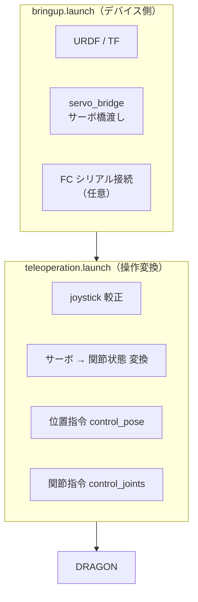
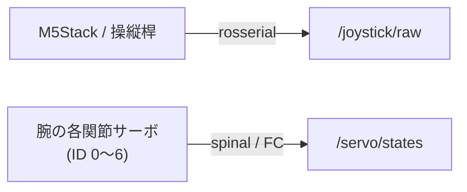

# 01. システム概要

## 役割

Dracomancer は、オペレータの腕に装着する外骨格デバイスです。
2 つの launch で「**デバイス自身の起動**」と「**DRAGON への遠隔操作**」を分離しています。

## ノード構成

| ノード（スクリプト） | 役割 | 主な入力 | 主な出力 |
| --- | --- | --- | --- |
| `joystick_calib_publisher.py` | 操縦桿の生値を較正して正規化 | `/joystick/raw` | `/dracomancer/joystick/calibrated` |
| `servo_to_joint_states.py` | サーボtick → ラジアンの関節状態へ変換 | `/servo/states` | `/dracomancer/joint_states` |
| `control_pose.py` | 操縦桿 → DRAGON 機体の速度指令 | `calibrated`, `flight_state`, `mocap/pose` | `/dragon/uav/nav` |
| `control_joints.py` | 腕関節 → DRAGON 形状指令（＋安全） | `joint_states`, `debug/fc_*`, `flight_state` | `/dragon/joints_ctrl`, `dragon_shape_safety` |

## デバイス側ハードウェア構成

- 腕関節サーボは **ID 0〜6 の 7 個**（肩・上腕・肘・手首）。
- FC（フライトコントローラ）接続は実機モードでのみ使用（`connect_fc`）。
- Khadas など表示なし環境での運用を想定し、RViz は既定で起動しません。

## 関連ドキュメント

- データの流れ → [02. データフロー](02_dataflow.md)
- 関節の対応付け → [03. 関節マッピング](03_joint_mapping.md)
