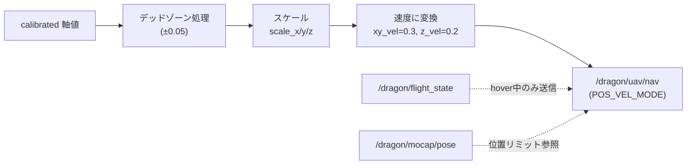
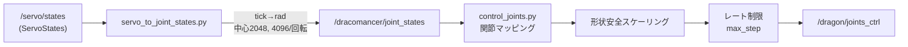

# 02. テレオペレーション データフロー

Dracomancer から DRAGON への指令は **2 系統**に分かれます。

## 全体フロー

```mermaid
flowchart TB
    subgraph POSE["① 位置系統（操縦桿 → 機体の移動）"]
        direction LR
        A1["M5/操縦桿シリアル"] --> A2["/joystick/raw"]
        A2 --> A3["joystick_calib_publisher.py"]
        A3 --> A4["/dracomancer/joystick/calibrated"]
        A4 --> A5["control_pose.py"]
        A5 --> A6["/dragon/uav/nav"]
    end
    subgraph JOINT["② 形状系統（腕の動き → 機体の関節）"]
        direction LR
        B1["Dracomancer サーボ状態"] --> B2["/servo/states"]
        B2 --> B3["servo_to_joint_states.py"]
        B3 --> B4["/dracomancer/joint_states"]
        B4 --> B5["control_joints.py"]
        B5 --> B6["/dragon/joints_ctrl"]
    end
```

## ① 位置系統（control_pose.py）

操縦桿の傾きを **DRAGON の速度指令**（`FlightNav`）に変換します。

要点:
- DRAGON が**ホバリング状態（flight_state ≥ 4）になってから**指令を送信。ホバ直後は `wait_after_hover`（既定 3 秒）待機。
- 制御モードは全軸 `POS_VEL_MODE`、対象は重心 `COG`、`WORLD_FRAME`。
- `pos_limit` 有効時は部屋内の安全範囲（X/Y/Z）にクランプ。

## ② 形状系統（servo_to_joint_states → control_joints）

要点:
- サーボの生 tick を `(tick - 2048) * 2π / 4096` でラジアン化。
- マッピング・安全機構の詳細は [03](03_joint_mapping.md) / [04](04_shape_safety.md)。

## 主なトピック一覧

| トピック | 型 | 向き | 説明 |
| --- | --- | --- | --- |
| `/joystick/raw` | `Int16MultiArray` | 入力 | 操縦桿の生値 |
| `/dracomancer/joystick/calibrated` | `Float32MultiArray` | 内部 | 較正済み軸値 |
| `/servo/states` | `spinal/ServoStates` | 入力 | 腕サーボの状態 |
| `/dracomancer/joint_states` | `JointState` | 内部 | 腕関節角 |
| `/dragon/uav/nav` | `aerial_robot_msgs/FlightNav` | 出力 | DRAGON 速度指令 |
| `/dragon/joints_ctrl` | `JointState` | 出力 | DRAGON 形状指令 |
| `/dracomancer/dragon_shape_safety` | `Float64MultiArray` | 出力 | 安全状態モニタ |
