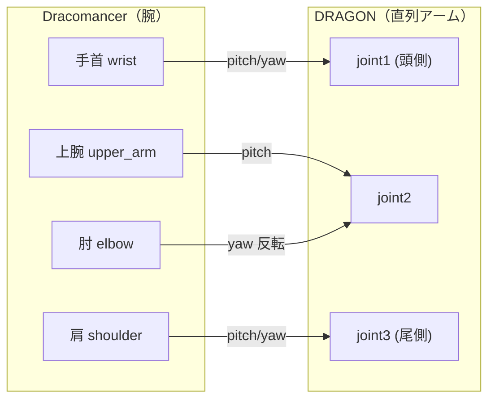

# 03. 関節マッピング

Dracomancer の腕関節を **DRAGON を 1 本の直列アーム**とみなして対応付けます。
DRAGON の `link1` が頭側、`link4` が尾側で、**手首 → 頭側、肩 → 尾側**に対応します。

## 対応イメージ

## 対応表（既定値）

| DRAGON 関節 | ← Dracomancer 関節 | sign | offset |
| --- | --- | --- | --- |
| `joint1_pitch` | `wrist_flexion_extension_joint` | +1 | 0 |
| `joint1_yaw` | `wrist_supination_joint` | +1 | π/2 |
| `joint2_pitch` | `upper_arm_external_internal_rotation_joint` | +1 | 0 |
| `joint2_yaw` | `elbow_flexion_extension_joint` | **−1** | 0 |
| `joint3_pitch` | `shoulder_flexion_extension_joint` | +1 | 0 |
| `joint3_yaw` | `shoulder_abduction_adduction_joint` | +1 | π/2 |

- スケールは既定 **1:1**。
- yaw 関節は公称 `π/2` オフセットを保持。ただし `joint2_yaw` のみ肘を**反転・オフセットなし**とし、肘を伸ばすと中間関節がまっすぐになるようにしています。

## 変換式

各 DRAGON 関節 `i` の目標角は次式で計算されます（`control_joints.py`）。

> `mapped = offset[i] + sign[i] * scale[i] * (source - neutral)` を `±joint_limit` でクランプ。

## サーボ ID → 関節名（servo_to_joint_states.py）

| サーボ ID | Dracomancer 関節名 |
| --- | --- |
| 0 | `shoulder_abduction_adduction_joint` |
| 1 | `shoulder_flexion_extension_joint` |
| 2 | `upper_arm_external_internal_rotation_joint` |
| 3 | `elbow_flexion_extension_joint` |
| 4 | `wrist_supination_joint` |
| 5 | `wrist_flexion_extension_joint` |
| 6 | `wrist_abduction_adduction_joint`（マッピング未使用） |

> 変換式: `rad = (tick − 2048) × 2π / 4096 + offset`
