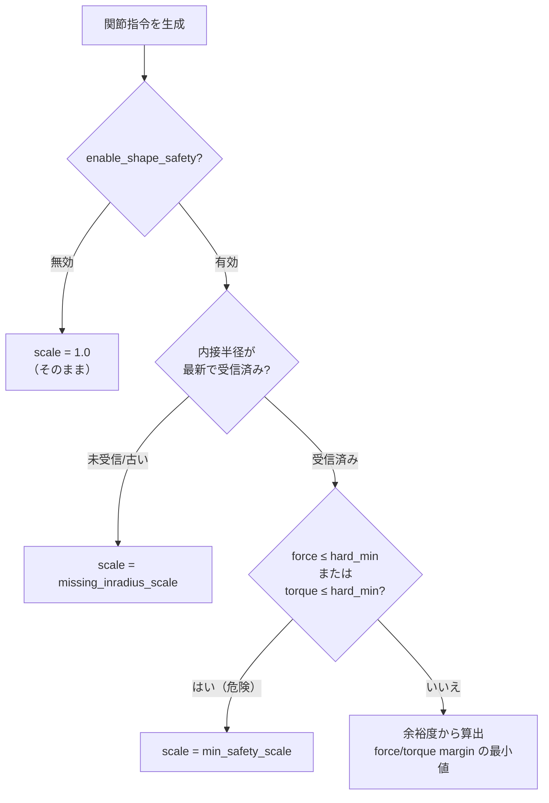
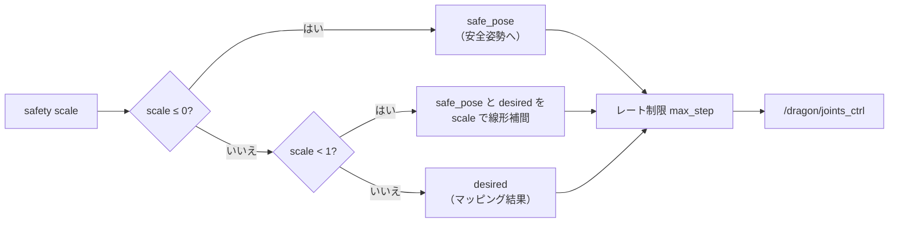
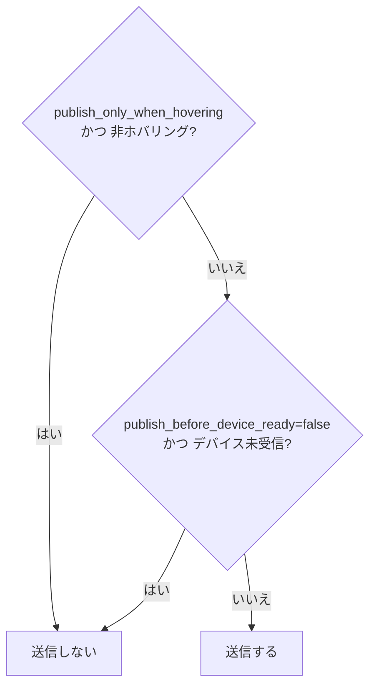

# 04. 形状安全機構

DRAGON が**明らかに飛行不可能な形状**に陥らないよう、`control_joints.py` は
DRAGON 側の「実現可能制御内接半径（feasible control inradius）」を参照して
関節指令をスケーリングします。

## 入力となる安全指標

DRAGON の制御器が公開する 2 つの内接半径を購読します。

| トピック | 意味 |
| --- | --- |
| `/dragon/debug/fc_f_min` | 力（force）の実現可能内接半径 |
| `/dragon/debug/fc_t_min` | トルク（torque）の実現可能内接半径 |

半径が小さいほど「その形状では制御余裕が少ない＝危険」を意味します。

## 安全スケールの決定フロー



- `force_margin = (force − f_hard_min) / (f_min − f_hard_min)`
- `torque_margin = (torque − t_hard_min) / (t_min − t_hard_min)`
- `scale = max(min_safety_scale, min(1.0, force_margin, torque_margin))`

## スケールの適用



## 送信ゲート

以下の条件を満たすときのみ `/dragon/joints_ctrl` を送信します。



## 主なパラメータ（既定値）

| パラメータ | 既定 | 説明 |
| --- | --- | --- |
| `enable_shape_safety` | true | 安全スケーリングの有効化 |
| `force_inradius_min` | 0.2 | 力 余裕の上端 |
| `force_inradius_hard_min` | 0.1 | 力 危険しきい値 |
| `torque_inradius_min` | 0.02 | トルク 余裕の上端 |
| `torque_inradius_hard_min` | 0.01 | トルク 危険しきい値 |
| `missing_inradius_scale` | 1.0 | 半径未受信時のスケール |
| `min_safety_scale` | 0.0 | スケール下限 |
| `max_step` | 0.04 | 1 制御周期あたりの最大変化量 |

## モニタリング

```bash
rostopic echo /dracomancer/dragon_shape_safety
# [force_inradius, torque_inradius, safety_scale]
```

> シミュレーションで安全機構が強すぎる場合は `enable_shape_safety:=false` や
> `min_safety_scale:=0.5` 等で緩和できます（[05. 起動方法](05_bringup.md) 参照）。
