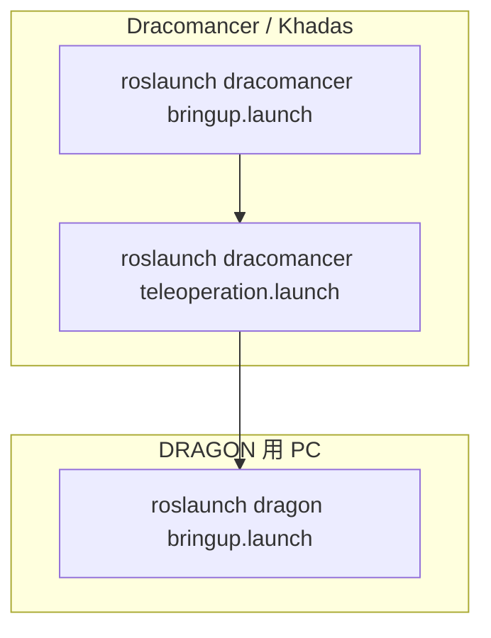
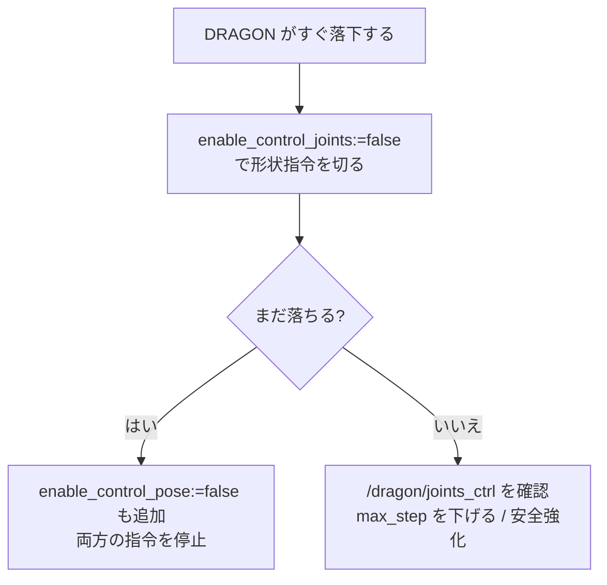

# 05. 起動方法

## 起動の全体像



> `rm`（real-machine）と `sim`（simulation）を通常使用します。
> `real_machine` / `simulation` は旧コマンド互換用エイリアスです。

## よく使うコマンド

DRAGON シミュレーションを動かす PC 側:

```bash
roslaunch dragon bringup.launch sim:=true headless:=false
```

Dracomancer / Khadas 側（FC 未接続）:

```bash
roslaunch dracomancer bringup.launch rm:=true sim:=false connect_fc:=false
```

Dracomancer / Khadas 側（FC 接続）:

```bash
roslaunch dracomancer bringup.launch rm:=true sim:=false fc_serial_port:=/dev/flight_controller
```

RViz のスライダだけで URDF を動かす（FC もシミュレータも不要）:

```bash
roslaunch dracomancer bringup.launch \
  rm:=false sim:=false gui:=true launch_rviz:=true headless:=false
```

通常のテレオペレーション:

```bash
roslaunch dracomancer teleoperation.launch
```

## bringup.launch の主な引数

| グループ | 引数 | 既定 | 用途 |
| --- | --- | --- | --- |
| モード | `rm` | True | 実機モードのショートカット |
| モード | `sim` | False | シミュレーションモード（true で `real_machine` が false に） |
| FC | `connect_fc` | `real_machine` | FC シリアル橋渡しの起動 |
| FC | `fc_serial_port` | `/dev/ttyUSB0` | FC のシリアルデバイス |
| FC | `fc_serial_baud` | `921600` | FC のボーレート |
| 表示 | `headless` | True | RViz/可視化を隠す |
| 表示 | `launch_rviz` | False | モデル launch で RViz 表示を許可 |
| 表示 | `gui` / `joint_gui` | False | `joint_state_publisher_gui` を使用 |
| サーボ | `use_servo_bridge` | True | `servo_bridge_node` を起動 |
| サーボ | `use_servo_to_joint_states` | False | サーボ状態→関節状態を bringup 内で変換 |

> Khadas は通常ディスプレイ無し。RViz は起動しないこと（GUI マシンでのみ `launch_rviz:=true headless:=false`）。

## teleoperation.launch の主なスイッチ

| 引数 | 説明 |
| --- | --- |
| `enable_control_pose` | `/dragon/uav/nav` 速度指令の有効化 |
| `enable_control_joints` | `/dragon/joints_ctrl` 形状指令の有効化 |
| `enable_servo_to_joint_states` | サーボ状態→関節状態変換の有効化 |
| `enable_shape_safety` | 形状安全スケーリングの有効化 |
| `min_safety_scale` | 安全スケールの下限 |
| `max_step` | 1 周期あたりの関節変化量上限 |
| `publish_joints_only_when_hovering` | ホバリング以降のみ形状指令を送信 |

### シミュレーションで落下を許容（安全機構を緩和）

```bash
roslaunch dracomancer teleoperation.launch \
  enable_shape_safety:=false \
  publish_joints_only_when_hovering:=true \
  publish_joints_before_device_ready:=false \
  max_step:=0.03
```

## デバッグ手順



```bash
# 各指令の確認
rostopic echo /dragon/uav/nav
rostopic echo /dragon/joints_ctrl
rostopic echo /dracomancer/dragon_shape_safety
```

## ビルド

```bash
catkin build aerial_robot_model dracomancer
source devel/setup.bash
```
