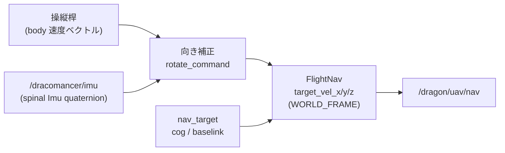
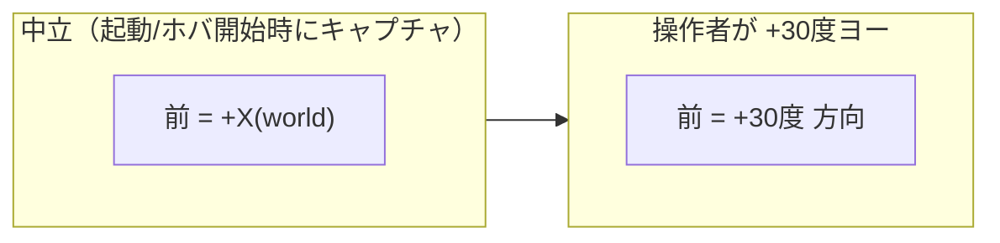
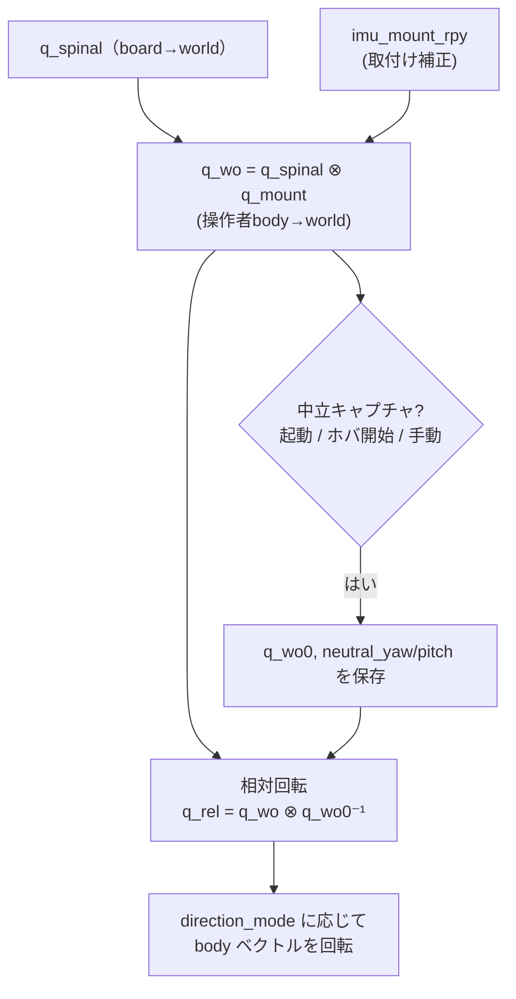
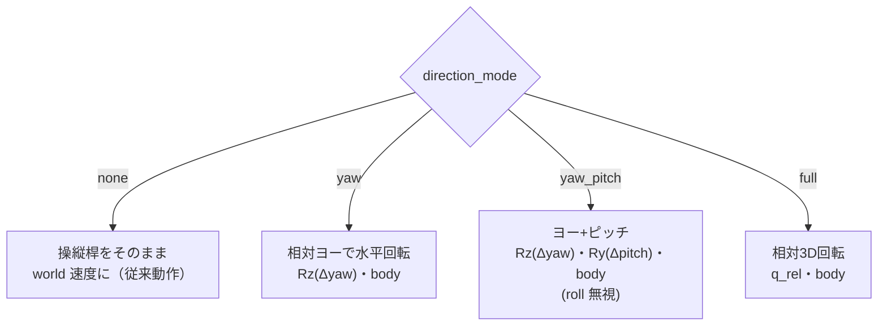
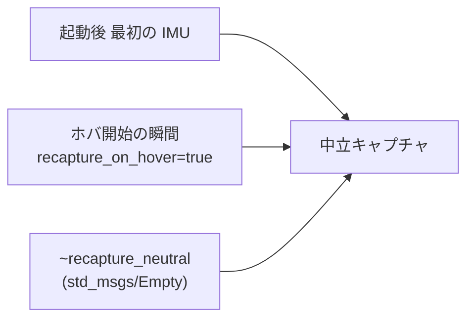
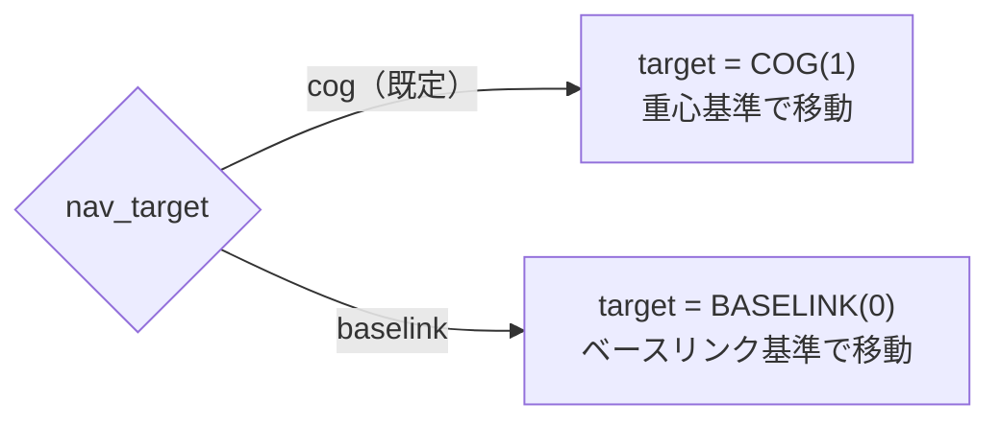

# 06. IMU 相対移動と移動対象切替

`control_pose.py` は、操縦桿の移動指令を **操作者の向きに対する相対移動**へ変換し、
さらに **重心(COG) / ベースリンク** の移動対象を切替えられます。

## 全体像



操作者が向きを変えると、操縦桿「前」の指す世界方向が一緒に回転します
（操作者の正面に対する相対移動）。



## 向きの計算（中立相対）



> **重要**: 中立キャプチャ方式では `yaw` モードのとき取付け補正 `q_mount` は
> 数式上キャンセルされ、ヨー操舵は取付け角に依存しません。
> `imu_mount_rpy` が効くのは `yaw_pitch` / `full` モードのみです。

## direction_mode（4 種を引数で切替）



| モード | 挙動 | 用途 |
| --- | --- | --- |
| `none` | 操縦桿＝world 速度（従来） | IMU を使わない |
| `yaw`（既定） | 左右の向きで水平移動方向を回転 | 最も直感的 |
| `yaw_pitch` | 前傾も移動方向に反映（roll 無視） | 体の傾きで上下方向も操作 |
| `full` | roll/pitch/yaw すべて反映 | 全身姿勢で操作 |

## 中立（正面）の基準

spinal は磁気を使わないと yaw がドリフトするため、**相対方式**を採用しています。



手動で取り直す:

```bash
rostopic pub -1 /dracomancer_control_pose/recapture_neutral std_msgs/Empty "{}"
```

## 移動対象（COG / baselink）の切替

`FlightNav.target` を切替えます（既定 COG）。



## 主なパラメータ（teleoperation.launch 引数）

| 引数 | 既定 | 説明 |
| --- | --- | --- |
| `nav_target` | `cog` | 移動対象（`cog` / `baselink`） |
| `direction_mode` | `yaw` | 向き補正モード（`none`/`yaw`/`yaw_pitch`/`full`） |
| `imu_topic` | `/dracomancer/imu` | spinal IMU トピック |
| `imu_mount_roll/pitch/yaw` | `0 / -π/2 / 0` | IMU 取付け補正 [rad]（実機で要調整） |
| `recapture_neutral_on_hover` | `true` | ホバ開始時に中立を取り直す |

## 使用例

操作者相対（ヨー）＋重心移動（既定）:

```bash
roslaunch dracomancer teleoperation.launch
```

ベースリンク移動・前傾も反映:

```bash
roslaunch dracomancer teleoperation.launch nav_target:=baselink direction_mode:=yaw_pitch
```

IMU を使わない従来動作:

```bash
roslaunch dracomancer teleoperation.launch direction_mode:=none
```

取付け補正を調整（例: roll 90度）:

```bash
roslaunch dracomancer teleoperation.launch \
  direction_mode:=full imu_mount_roll:=1.5708 imu_mount_pitch:=0.0
```
