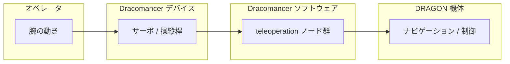

# Dracomancer ドキュメント

Dracomancer は **DRAGON を遠隔操作するための上肢外骨格（エクソスケルトン）デバイス**です。
オペレータの腕の動きをサーボで読み取り、DRAGON の機体姿勢指令・関節（形状）指令へ変換します。

## 目次

| # | ドキュメント | 内容 |
| --- | --- | --- |
| 01 | [システム概要](01_overview.md) | 役割・ノード構成・全体像 |
| 02 | [テレオペレーション データフロー](02_dataflow.md) | トピックの流れ（操縦桿 / サーボ） |
| 03 | [関節マッピング](03_joint_mapping.md) | Dracomancer 関節 → DRAGON 関節の対応 |
| 04 | [形状安全機構](04_shape_safety.md) | 実現可能性に基づく指令スケーリング |
| 05 | [起動方法](05_bringup.md) | launch 引数とよく使うコマンド |
| 06 | [IMU 相対移動と移動対象切替](06_imu_relative_control.md) | 操作者の向きに応じた相対移動 / COG・baselink 切替 |

## 全体像（ひとめ）

> メモ: `src/` 以下の C++（`dracomancer.cpp` 等）は現状すべて空のプレースホルダで、
> 実処理は `scripts/` 配下の Python ノードが担っています。
