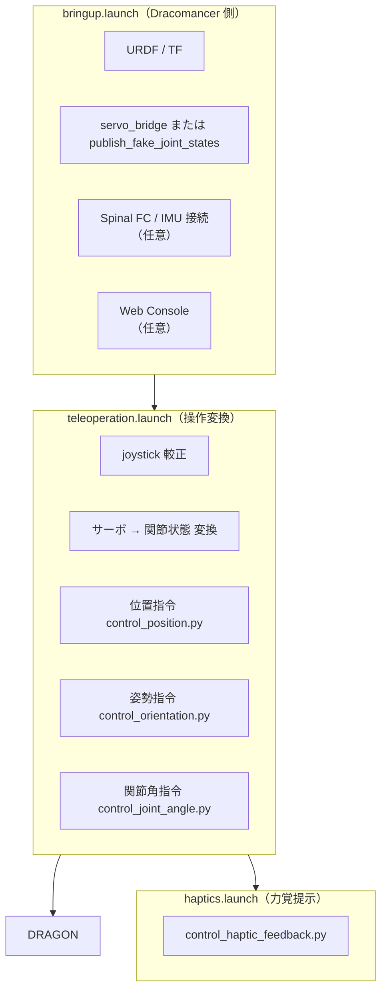
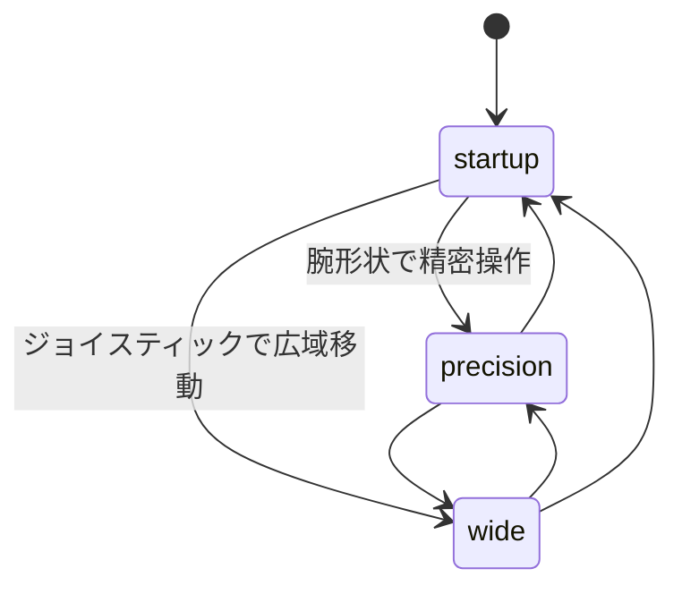
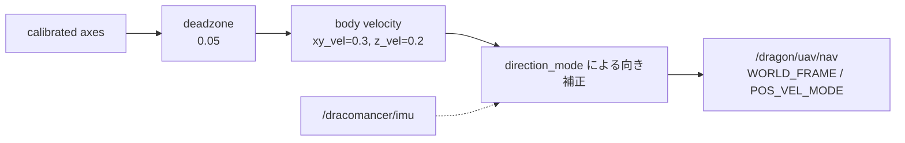
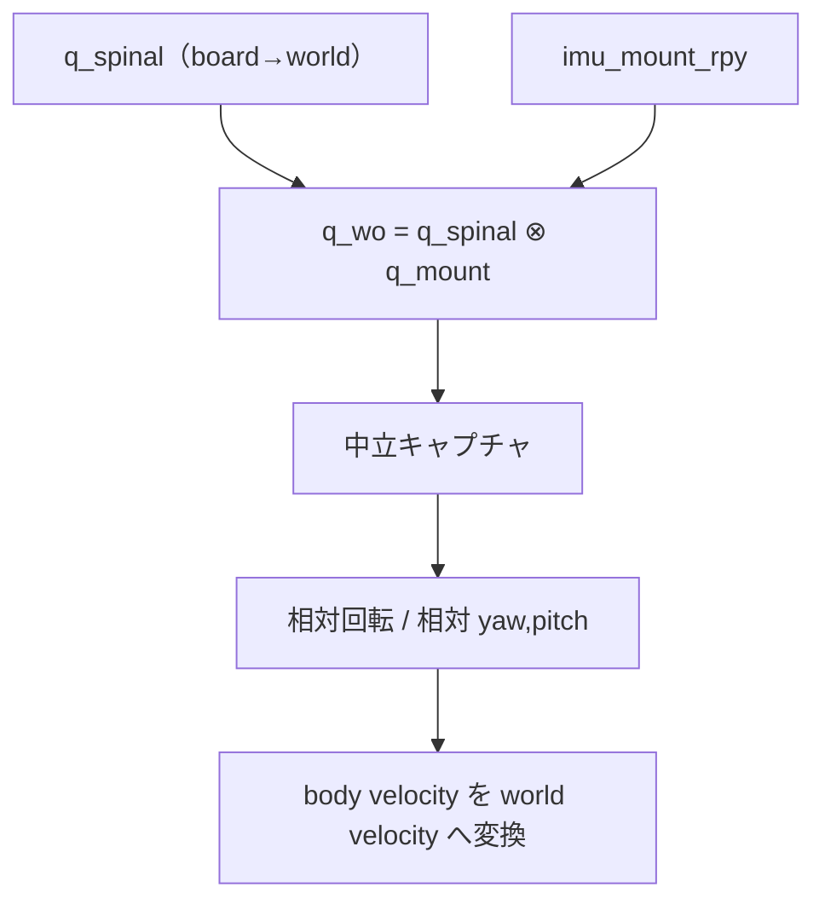
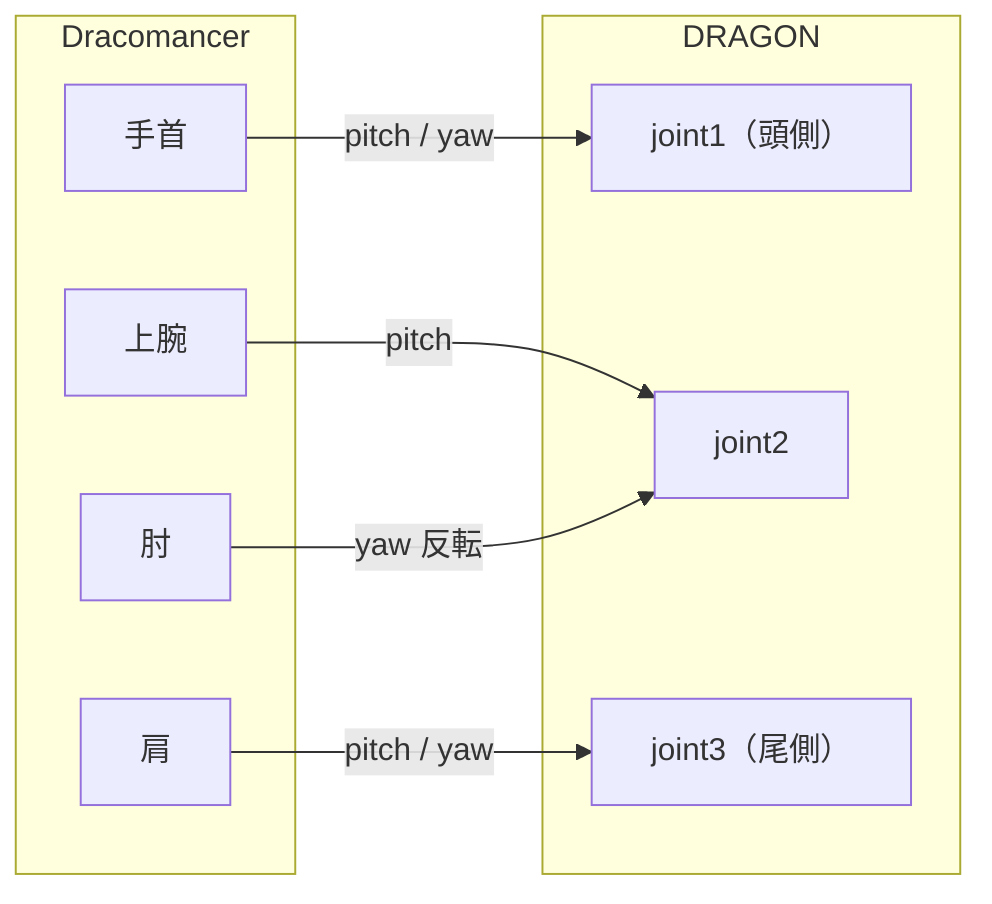
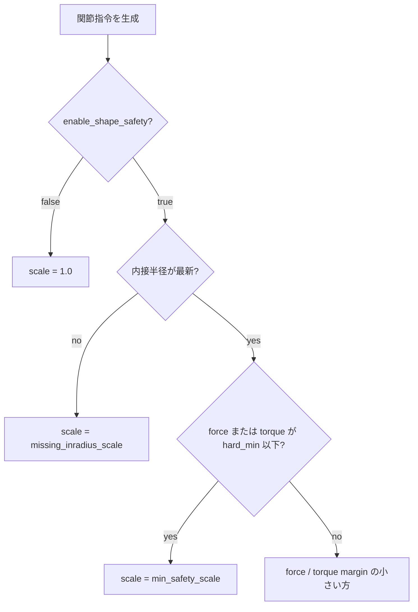

# Dracomancer システム仕様

このドキュメントは、Dracomancer の現在の実装に基づくシステム仕様をまとめたものです。
Dracomancer は、オペレータの腕に装着する上肢外骨格型遠隔操作デバイスであり、現状では主に DRAGON の移動指令と形状指令を生成します。

> 現状の実装メモ: `src/` 以下の C++ ファイルはプレースホルダで、実際の処理は `scripts/` 配下の Python ノードが担っています。力覚提示は安全スケーリングで抑制された形状入力を関節トルクへ戻す簡易実装で、最適化ベースの本格的な姿勢制限は未実装です。

## 全体構成

Dracomancer は、デバイス自身の起動と DRAGON への遠隔操作変換を launch 単位で分けています。



主なノード構成:

| ノード | 役割 | 主な入力 | 主な出力 |
| --- | --- | --- | --- |
| `calibrate_joystick.py` | 操縦桿の生値を較正して正規化 | `/joystick/raw` | `/dracomancer/joystick/calibrated` |
| `convert_servo_to_joint_states.py` | サーボtickをラジアンの関節状態へ変換 | `/servo/states` | `/dracomancer/joint_states` |
| `control_position.py` | 操縦桿とIMUから DRAGON の速度指令を生成 | joystick, IMU, flight_state | `/dragon/uav/nav` |
| `control_orientation.py` | 操縦桿から姿勢指令を生成 | joystick, flight_state | `/dragon/final_target_baselink_rpy` |
| `control_joint_angle.py` | 腕関節から DRAGON の形状指令を生成 | joint_states, fc inradius, flight_state | `/dragon/joints_ctrl`, `/dracomancer/dragon_shape_safety`, `/dracomancer/shape_control_error` |
| `control_haptic_feedback.py` | 抑制された形状入力から力覚提示を生成 | joint_states, shape_control_error, mode | `/dracomancer/haptic_torque`, `/servo/target_current` |
| `publish_fake_joint_states.py` | 実機なしで Dracomancer 関節状態を生成 | `/dracomancer/joint_cmd` | `/dracomancer/joint_states` |

デバイス側ハードウェア:

- 腕関節サーボは ID 0-6 の 7 個（肩・上腕・肘・手首）。
- サーボ状態は Spinal / FC 経由で `/servo/states` として扱います。
- 背中部 IMU は `/dracomancer/imu` として、操作者相対の移動方向補正に使います。
- M5Stack / 操縦桿は `/joystick/raw` の入力元です。

## テレオペレーションのデータフロー

Dracomancer から DRAGON への指令は、位置系統と形状系統の2つに分かれます。

```mermaid
flowchart TB
    subgraph POSE["位置系統（操縦桿 → 機体移動）"]
        A1["M5 / 操縦桿"] --> A2["/joystick/raw"]
        A2 --> A3["calibrate_joystick.py"]
        A3 --> A4["/dracomancer/joystick/calibrated"]
        A4 --> A5["control_position.py"]
        A5 --> A6["/dragon/uav/nav"]
    end
    subgraph JOINT["形状系統（腕の動き → 機体関節）"]
        B1["Dracomancer サーボ状態"] --> B2["/servo/states"]
        B2 --> B3["convert_servo_to_joint_states.py"]
        B3 --> B4["/dracomancer/joint_states"]
        B4 --> B5["control_joint_angle.py"]
        B5 --> B6["/dragon/joints_ctrl"]
        B5 --> B7["/dracomancer/shape_control_error"]
        B7 --> B8["control_haptic_feedback.py"]
        B4 --> B8
        B8 --> B9["/dracomancer/haptic_torque"]
    end
```



主なトピック:

| トピック | 型 | 説明 |
| --- | --- | --- |
| `/joystick/raw` | `std_msgs/Int16MultiArray` | 操縦桿の生値 |
| `/dracomancer/joystick/calibrated` | `std_msgs/Float32MultiArray` | 較正済み軸値 |
| `/servo/states` | `spinal/ServoStates` | 腕サーボの状態 |
| `/dracomancer/imu` | `spinal/Imu` | 操作者姿勢のIMU quaternion |
| `/dracomancer/joint_states` | `sensor_msgs/JointState` | Dracomancer の腕関節角 |
| `/dragon/uav/nav` | `aerial_robot_msgs/FlightNav` | DRAGON の速度指令 |
| `/dragon/joints_ctrl` | `sensor_msgs/JointState` | DRAGON の形状指令 |
| `/dracomancer/dragon_shape_safety` | `std_msgs/Float64MultiArray` | `[force_inradius, torque_inradius, safety_scale]` |
| `/dracomancer/shape_control_error` | `std_msgs/Float64MultiArray` | 力覚提示用の形状抑制量 `q_des - q_tar` |
| `/dracomancer/haptic_torque` | `sensor_msgs/JointState` | 安全スケーリングで抑制された入力差から計算した Dracomancer 7関節の提示トルク |

## 操作モード

`teleoperation.launch` は `teleop_mode` で、立ち上げ、精密動作、広域移動を切り替えます。起動時の既定は `startup` です。実行中は `/dracomancer/teleop_mode` に `std_msgs/String` を送ることで切り替えられます。



| モード | 移動指令 `/dragon/uav/nav` | 形状指令 `/dragon/joints_ctrl` | 用途 |
| --- | --- | --- | --- |
| `startup` | 送信しない | `startup_pose` を保持 | 離陸前後に DRAGON を通常姿勢へ保つ |
| `precision` | 送信しない | Dracomancer 腕関節を DRAGON へマッピング | 接触作業や狭い姿勢調整 |
| `wide` | ジョイスティック + IMU 相対移動を送信 | `wide_hold_pose` を保持 | 広域移動。機械学習による意図変換は使わない |

切り替え例:

```bash
rostopic pub -1 /dracomancer/teleop_mode std_msgs/String "data: 'wide'"
rostopic pub -1 /dracomancer/teleop_mode std_msgs/String "data: 'precision'"
rostopic pub -1 /dracomancer/teleop_mode std_msgs/String "data: 'startup'"
```

### 位置系統

`control_position.py` は、`teleop_mode=wide` のときだけ較正済み操縦桿入力を `FlightNav` の速度指令へ変換します。DRAGON がホバリング状態（`flight_state >= 4`）になってから送信し、ホバ直後は `wait_after_hover`（既定 3 秒）待機します。



ジョイスティック仕様:

- `teleoperation.launch` の joystick 較正は既定で `axis_indices=[0, 1]` の2軸のみです。
- `axis_x=0` を前後、`axis_y=1` を左右、`axis_z=2` を上下として扱います。
- 既定の較正済みメッセージには3軸目が無いため、Z方向入力は0になります。Z軸を使う場合は、操縦桿側と較正設定を3軸に拡張してください。
- `xy_vel=0.3`、`z_vel=0.2` が既定の最大速度スケールです。
- `pos_limit=true` のとき、`/dragon/mocap/pose` が部屋範囲外または境界にある場合は、さらに外側へ向かう速度成分を0にします。

### IMU 相対移動

`direction_mode` により、操縦桿の移動方向を操作者の向きに対する相対方向へ変換します。spinal は磁気を使わない場合 yaw がドリフトしやすいため、起動時またはホバ開始時の中立姿勢からの相対回転を使います。



| `direction_mode` | 挙動 | 用途 |
| --- | --- | --- |
| `none` | 操縦桿をそのまま world 速度として使う | IMUを使わない |
| `yaw` | 中立からの相対ヨーで水平移動方向を回転 | 既定。最も扱いやすい想定 |
| `yaw_pitch` | 相対ヨーと相対ピッチを反映 | 前傾も移動方向へ反映したい場合 |
| `full` | 相対3D回転をそのまま反映 | 全身姿勢を強く反映する実験用 |

中立は以下で取り直します。

- 起動後、最初に有効なIMUを受け取った時
- `recapture_neutral_on_hover=true` の状態でホバリングへ遷移した時
- `~recapture_neutral` に `std_msgs/Empty` を送った時

手動取り直し例:

```bash
rostopic pub -1 /dracomancer_control_position/recapture_neutral std_msgs/Empty "{}"
```

移動対象は `nav_target` で切り替えます。

| `nav_target` | `FlightNav.target` | 意味 |
| --- | --- | --- |
| `cog` | `FlightNav.COG` | 重心基準で移動（既定） |
| `baselink` | `FlightNav.BASELINK` | ベースリンク基準で移動 |

## 立ち上げ・精密・広域移動の形状制御

`control_joint_angle.py` は全モードで `/dragon/joints_ctrl` を担当します。モードごとの目標形状は以下です。

| モード | 目標形状 |
| --- | --- |
| `startup` | `startup_pose`。既定 `[0, pi/2, 0, pi/2, 0, pi/2]` |
| `precision` | Dracomancer 腕関節からのマッピング結果 |
| `wide` | `wide_hold_pose`。既定は `startup_pose` と同じ |

`startup_pose` は DRAGON の通常姿勢へ戻す `transformation_demo.py _reset:=1` と同じ考え方で、離陸時に人間の腕形状へ直接マッピングできない問題を避けるための保持姿勢です。実機で離陸前の関節指令が反映されるかは、DRAGON 側の preflight joint control 設定に依存します。

## 関節マッピング

Dracomancer の腕関節を、DRAGON を1本の直列アームとみなして対応付けます。DRAGON の `link1` が頭側、`link4` が尾側で、手首が頭側、肩が尾側に対応します。



既定の対応:

| DRAGON 関節 | Dracomancer 関節 | sign | offset |
| --- | --- | --- | --- |
| `joint1_pitch` | `wrist_flexion_extension_joint` | +1 | 0 |
| `joint1_yaw` | `wrist_supination_joint` | +1 | pi/2 |
| `joint2_pitch` | `upper_arm_external_internal_rotation_joint` | +1 | 0 |
| `joint2_yaw` | `elbow_flexion_extension_joint` | -1 | 0 |
| `joint3_pitch` | `shoulder_flexion_extension_joint` | +1 | 0 |
| `joint3_yaw` | `shoulder_abduction_adduction_joint` | +1 | pi/2 |

変換式:

```text
mapped = offset[i] + sign[i] * scale[i] * (source - neutral)
target = clamp(mapped, -joint_limit, joint_limit)
```

- `scale` は既定で全関節 1.0 です。
- `joint_limit` は既定で `pi/2` です。
- `capture_neutral_on_first_msg=false` が既定なので、通常は neutral=0 として扱われます。
- `joint2_yaw` は肘を反転し、オフセットなしで扱います。

サーボIDと Dracomancer 関節名:

| サーボID | 関節名 |
| --- | --- |
| 0 | `shoulder_abduction_adduction_joint` |
| 1 | `shoulder_flexion_extension_joint` |
| 2 | `upper_arm_external_internal_rotation_joint` |
| 3 | `elbow_flexion_extension_joint` |
| 4 | `wrist_supination_joint` |
| 5 | `wrist_flexion_extension_joint` |
| 6 | `wrist_abduction_adduction_joint`（DRAGON マッピングでは未使用） |

サーボtickから関節角への変換:

```text
rad = (tick - 2048) * 2*pi / 4096 + offset
```

## 形状安全機構

`control_joint_angle.py` は、DRAGON 側の実現可能制御内接半径（feasible control inradius）を参照し、明らかに飛行不可能な形状へ強く押し込まないよう関節指令をスケーリングします。

入力となる安全指標:

| トピック | 意味 |
| --- | --- |
| `/dragon/debug/fc_f_min` | 力の実現可能内接半径 |
| `/dragon/debug/fc_t_min` | トルクの実現可能内接半径 |

安全スケール:



計算:

```text
force_margin  = (force  - force_hard_min)  / (force_min  - force_hard_min)
torque_margin = (torque - torque_hard_min) / (torque_min - torque_hard_min)
scale = max(min_safety_scale, min(1.0, force_margin, torque_margin))
```

スケール適用:

- `scale <= 0`: `safe_pose` へ戻す
- `0 < scale < 1`: `safe_pose` とマッピング結果を線形補間
- `scale >= 1`: マッピング結果をそのまま使う
- 最後に `max_step` で1周期あたりの関節変化量を制限する

送信ゲート:

| 条件 | 既定 | 挙動 |
| --- | --- | --- |
| `publish_joints_only_when_hovering` | `false` in `teleoperation.launch` | trueならホバリング前は `/dragon/joints_ctrl` を送らない |
| `publish_joints_before_device_ready` | `false` | `precision` では false なら Dracomancer 関節状態を受け取るまで送らない |

`control_joint_angle.py` 単体の既定値では `publish_only_when_hovering=true` ですが、`teleoperation.launch` では `false` を渡しています。通常運用の既定値は launch 側を基準にしてください。

主なパラメータ:

| パラメータ | 既定 | 説明 |
| --- | --- | --- |
| `enable_shape_safety` | `true` | 安全スケーリングの有効化 |
| `force_inradius_min` | `0.2` | 力余裕の上端 |
| `force_inradius_hard_min` | `0.1` | 力の危険しきい値 |
| `torque_inradius_min` | `0.02` | トルク余裕の上端 |
| `torque_inradius_hard_min` | `0.01` | トルクの危険しきい値 |
| `missing_inradius_scale` | `1.0` in `teleoperation.launch` | 半径未受信時のスケール |
| `min_safety_scale` | `0.0` | スケール下限 |
| `max_step` | `0.04` | 1周期あたりの最大変化量 |
| `startup_pose` | `[0, pi/2, 0, pi/2, 0, pi/2]` | 立ち上げ時の通常姿勢 |
| `wide_hold_pose` | `startup_pose` | 広域移動中に保持する形状 |

モニタリング:

```bash
rostopic echo /dracomancer/dragon_shape_safety
```

## 力覚提示

`haptics.launch` の `control_haptic_feedback.py` は、精密動作モードで安全スケーリングにより抑制された形状差を用いて、Dracomancer 側の7関節へ返す提示トルクを計算します。

```text
e_q = q_des - q_tar
tau_q = K_q e_q
tau_device = B^T tau_q - D_h theta_dot
```

ここで `B` は既定の腕関節から DRAGON 6関節への差分マッピングです。実装では、論文補助資料のレンチ分配問題を直接解くのではなく、まず `B^T K_q e_q` による形状空間からデバイス関節空間への直接写像として扱います。

出力:

| トピック | 型 | 説明 |
| --- | --- | --- |
| `/dracomancer/haptic_torque` | `sensor_msgs/JointState` | `effort` に7関節の提示トルクを格納 |
| `/servo/target_current` | `spinal/ServoControlCmd` | 明示的に有効化した場合のみ、提示トルクを電流指令へ変換 |

実機サーボへの電流指令は安全のため既定で無効です。有効化する場合は、少なくとも `enable_haptic_current_command=true` と `haptic_current_per_nm` を実機で較正した値に設定してください。

```bash
roslaunch dracomancer haptics.launch
```

実機電流指令まで出す例:

```bash
roslaunch dracomancer haptics.launch \
  enable_haptic_current_command:=true \
  haptic_current_per_nm:=100.0
```

## 起動方法

DRAGON シミュレーションを動かすPC側:

```bash
roslaunch dragon bringup.launch sim:=true headless:=false
```

Dracomancer / Khadas 側（FC未接続）:

```bash
roslaunch dracomancer bringup.launch rm:=true sim:=false connect_fc:=false
```

Dracomancer / Khadas 側（FC接続）:

```bash
roslaunch dracomancer bringup.launch rm:=true sim:=false fc_serial_port:=/dev/flight_controller
```

実機なしで Dracomancer 関節状態を試す:

```bash
roslaunch dracomancer bringup.launch rm:=false sim:=true headless:=false
```

通常のテレオペレーション:

```bash
roslaunch dracomancer teleoperation.launch
```

起動直後は `startup` モードです。ホバリング後、広域移動へ切り替える例:

```bash
rostopic pub -1 /dracomancer/teleop_mode std_msgs/String "data: 'wide'"
```

腕形状を使う精密動作へ切り替える例:

```bash
rostopic pub -1 /dracomancer/teleop_mode std_msgs/String "data: 'precision'"
```

シミュレーションで形状安全を緩める例:

```bash
roslaunch dracomancer teleoperation.launch \
  enable_shape_safety:=false \
  publish_joints_only_when_hovering:=true \
  publish_joints_before_device_ready:=false \
  max_step:=0.03
```

IMUを使わない従来方向入力:

```bash
roslaunch dracomancer teleoperation.launch direction_mode:=none
```

ベースリンク移動・前傾反映:

```bash
roslaunch dracomancer teleoperation.launch nav_target:=baselink direction_mode:=yaw_pitch
```

### `bringup.launch` の主な引数

| グループ | 引数 | 既定 | 用途 |
| --- | --- | --- | --- |
| モード | `rm` | `True` | 実機サーボ / Spinal FC を使う |
| モード | `sim` | `False` | RViz表示の既定値に使う |
| 表示 | `headless` | `True` | モデル表示を隠す |
| 表示 | `launch_rviz` | `$(arg sim)` | RVizを起動する |
| Web | `web` | `False` | Web Console を起動する |
| Web | `web_console_port` | `8080` | Web Console のポート |
| Web | `web_console_rosbridge_port` | `9090` | rosbridge のポート |
| FC | `connect_fc` | `$(arg rm)` | Spinal bridge を起動する |
| FC | `fc_serial_port` | `/dev/ttyUSB0` | FC のシリアルデバイス |
| FC | `fc_serial_baud` | `921600` | FC のボーレート |
| FC | `run_servo_rough_calib` | `False` | `servo_rough_calib.py` を起動する |
| サーボ | `servo_topic` | `/servo/states` | `convert_servo_to_joint_states.py` の入力 |
| サーボ | `joint_states_topic` | `/dracomancer/joint_states` | Dracomancer 関節状態の出力 |

`rm=true` では `servo_bridge_node` と `convert_servo_to_joint_states.py` を起動します。`rm=false` では `publish_fake_joint_states.py` を起動し、`sim=true` かつ `web=false` のとき `joint_state_publisher_gui` も起動します。

### `teleoperation.launch` の主な引数

| 引数 | 既定 | 用途 |
| --- | --- | --- |
| `device_ns` | `dracomancer` | Dracomancer 側の名前空間 |
| `robot_ns` | `dragon` | 操縦対象ロボットの名前空間 |
| `enable_joystick_serial` | `false` | rosserial の joystick serial node を起動する |
| `js_raw_topic` | `/joystick/raw` | 操縦桿生値 |
| `js_calibrated_topic` | `/dracomancer/joystick/calibrated` | 較正済み操縦桿 |
| `enable_servo_to_joint_states` | `true` | サーボ状態をDracomancer関節状態へ変換する |
| `enable_position_control` | `true` | `/dragon/uav/nav` を送る |
| `enable_attitude_control` | `false` | `/dragon/final_target_baselink_rpy` を送る |
| `enable_joint_angle_control` | `true` | `/dragon/joints_ctrl` を送る |
| `teleop_mode` | `startup` | `startup` / `precision` / `wide` |
| `mode_topic` | `/dracomancer/teleop_mode` | 実行中のモード切替トピック |
| `nav_target` | `cog` | 移動対象 `cog` / `baselink` |
| `direction_mode` | `yaw` | `none` / `yaw` / `yaw_pitch` / `full` |
| `imu_topic` | `/dracomancer/imu` | 操作者IMU |
| `imu_mount_roll/pitch/yaw` | `0 / -1.57079632679 / 0` | IMU取付け補正 |
| `recapture_neutral_on_hover` | `true` | ホバ開始時に中立向きを取り直す |
| `enable_shape_safety` | `true` | 形状安全スケーリング |
| `publish_joints_only_when_hovering` | `false` | trueならホバリング以降のみ形状指令を送る |
| `publish_joints_before_device_ready` | `false` | falseなら関節状態受信前は送らない |
| `axis_x/y/z` | `0 / 1 / 2` | ジョイスティック軸番号 |
| `xy_vel` | `0.3` | XY速度スケール |
| `z_vel` | `0.2` | Z速度スケール |
| `max_step` | `0.04` | 関節指令のレート制限 |

## デバッグ

各指令の確認:

```bash
rostopic echo /dragon/uav/nav
rostopic echo /dragon/joints_ctrl
rostopic echo /dracomancer/dragon_shape_safety
```

DRAGON がすぐ落下する場合の切り分け:

```bash
roslaunch dracomancer teleoperation.launch enable_joint_angle_control:=false
```

それでも落ちる場合は、移動指令も止めて確認します。

```bash
roslaunch dracomancer teleoperation.launch \
  enable_position_control:=false \
  enable_joint_angle_control:=false
```

形状指令を切ると落ちない場合は、`/dragon/joints_ctrl`、`max_step`、`enable_shape_safety`、`missing_inradius_scale`、関節マッピングを確認してください。

## 実装上の未完了項目

研究仕様に対して、現状で未完了または暫定扱いの項目です。

| 項目 | 現状 |
| --- | --- |
| 立ち上げ時の通常形状保持 | `startup` モードで実装。DRAGON 側の preflight joint control 設定に依存 |
| 力覚提示 | 未実装。サーボを用いた反力・反トルク提示は設計段階 |
| Force/Torque Volume に基づく厳密な姿勢制限 | DRAGON の内接半径を使ったスケーリングのみ実装 |
| C++ controller/model/optimizer | 空のプレースホルダ |
| ジョイスティックZ軸 | `control_position.py` は対応。launch の既定較正は2軸のため、3軸目がなければ0 |
| 位置リミット | `/dragon/mocap/pose` を使い、境界外へ向かう速度成分を0にする形で実装 |

## ビルド

```bash
catkin build aerial_robot_model dracomancer
source devel/setup.bash
```
