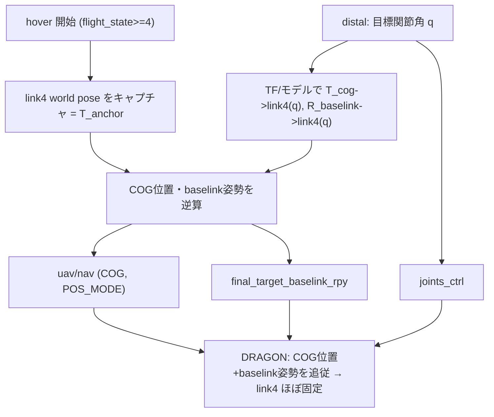

# distal の link4 アンカー

> 状態: **実装済み**（[../scripts/control/control_joint_angle.py](../scripts/control/control_joint_angle.py)
> `update_link4_anchor`）。distal マッピングの標準設計の一部として、関節操作時に DRAGON の
> **link4（腕先端側）をワールドにおおよそ固定**する。既定 ON（`enable_link4_anchor:=true`）。
> `joints_ctrl` と同じ目標関節角から link4 の相対姿勢を先に計算し、COG 位置と baselink 姿勢を
> 同周期で補償する。「完全静止」は要求しない（スルーレート/フィージビリティによる多少のズレは許容）。実機（Gazebo）
> での挙動確認は teleoperation.launch 再起動後に行うこと。

## 背景・目的

distal は人間の腕関節を DRAGON 各関節へ絶対角で写像するが、`joints_ctrl` は**相対形状しか
決めない**。実飛行でどのリンクが世界に止まるかは「COG 位置保持 ＋ baselink(link2) 姿勢保持」で
決まり、既定では**運動学ルートの link1 側が止まって見える**（[../README.md](../README.md) 形状制御節 / 02_robot_model）。

操縦の直感としては、**腕先端側 link4 を固定**し、手首を曲げれば link1 が振れ、肩を曲げれば
link1〜3 が振れる挙動が望ましい。これを distal の標準挙動として組み込む。

## 決定事項（実装に反映済み）

1. **distal の標準設計の一つ**として `control_joint_angle.py` 内に実装（別ノードにしない）。
2. **基準（link4 の固定目標姿勢）はホバー開始時にキャプチャ**する。
   - `flight_state >= 4`（hovering）への遷移時に、その時点の link4 world pose を記録。
   - `~recapture_anchor`(std_msgs/Empty) で再キャプチャ可能。ホバリングを抜けると基準は破棄し次のホバーで再取得。

## DRAGON 制御の前提（確認済み）

- 位置制御点は **COG**（[../../../aerial_robot_control/src/flight_navigation.cpp](../../../aerial_robot_control/src/flight_navigation.cpp) は位置目標を COG として扱う）。
- 姿勢は **baselink = link2(`fc`)** を保持。`/<robot>/final_target_baselink_rpy`(Vector3Stamped, [r,p,y]) で
  絶対姿勢を指令可能（[../../dragon/src/dragon_navigation.cpp](../../dragon/src/dragon_navigation.cpp) `targetBaselinkRPYCallback`）。
- baselink 姿勢はスルーレート制限あり（`baselink_rot_change_thresh`≈0.04 / `baselink_rot_pub_interval`≈0.2s
  → 約 0.2 rad/s）。
- baselink を link4 に変えるのは不可（IMU/FC が物理的に link2 にある）。
- **DRAGON コア改造は不要**。Dracomancer 側で nav + baselink_rpy + joints を協調送信する。

## 制御の考え方

link4 のワールド姿勢を基準 `T_anchor`（ホバー開始時キャプチャ）に保つよう、毎周期 COG 位置と
baselink 姿勢を補償指令する。目標関節角 `q`（distal が算出）に対し、モデル/TF から
`T_cog→link4(q)`・`R_baselink→link4(q)` を得て：

```text
COG_world      = T_anchor · T_cog→link4(q)^{-1}          # uav/nav の COG 位置目標 (POS_MODE)
baselink_world.M = T_anchor.M · R_baselink→link4(q)^{-1} # final_target_baselink_rpy (RPY)
joints_ctrl    = q                                       # 形状
```

これら3つを**同時送信**する。実装では `T_anchor` を TF（`world`→`<robot>/link4`）から取得し、
`T_baselink→link4(q)` は DRAGON v1/v1.5 の最小FK（`fc` 固定先の link2 から joint2/joint3 をたどる）で
`joints_ctrl` と同じ目標関節角から計算する。`T_cog→link4(q)` は現在TFの `cog→fc` と目標FKの
`fc→link4(q)` を合成する近似とする。
形状は `max_step` で緩やかに変わるが、link4 補償は現在 link4 TF の後追いではなく、目標形状への
フィードフォワードとして行う。
キャプチャ直後の初回補償は、現在TFの `cog→fc` と目標FKを使うため、通常は現在姿勢に近い指令から始まる。



## 注意点・限界（完全静止不要なので許容）

- baselink 姿勢のスルーレート制限で、速い関節操作時は link4 が一時的にズレ、遅れて追従。
- 補償姿勢が大きいとベクタリングのフィージビリティ限界に当たる → 形状変化は控えめに。
- 位置制御を使う必要がある。既存 `enable_position_control` の経路は `POS_VEL_MODE`＋`target_pos`
  未設定で落下するバグがあるため（[../README.md](../README.md) 既知の課題）、本機能は**絶対 COG 位置
  (POS_MODE)** を送る別ロジックで実装する。
- 操縦桿による移動（control_position）と同時利用すると、両者が `uav/nav` を書いて競合する。
  本機能 ON 時は移動制御（`enable_position_control`）を OFF にすること（既定で OFF）。

## パラメータ（control_joint_angle）

| param | 既定 | 説明 |
| --- | --- | --- |
| `~enable_link4_anchor` | `true` | distal 時に link4 アンカーを有効化 |
| `~anchor_link` | `link4` | 固定するリンク名（`<robot>/<anchor_link>`） |
| `~world_frame` | `world` | アンカー基準のワールドフレーム |
| `~cog_frame` / `~baselink_frame` | `<robot>/cog` / `<robot>/fc` | COG・baselink の TF フレーム |
| `~nav_topic` / `~baselink_rpy_topic` | `/<robot>/uav/nav` / `/<robot>/final_target_baselink_rpy` | 出力先 |
| `~dragon_link_length` / `~dragon_inter_joint_x_offset` / `~dragon_link2_fc_xyz` | `0.474` / `0.02575` / `[0.3245, -0.0010, 0.0280]` | link4 アンカー用の最小 DRAGON FK パラメータ |
| `~recapture_anchor`(Empty) | – | 基準の再キャプチャ要求 |

## 残課題 / TODO

- 実機（Gazebo）での挙動確認（ズレ量、追従、フィージビリティ）。
- z（高度）・yaw の追従品質確認（baselink yaw が大きく回る局面の評価）。
- 移動制御（操縦桿）との両立（uav/nav の合成）。
- 必要なら COG 変化も含むモデルFK（aerial_robot_model）に切替えて、位置補償の精度を上げる。
