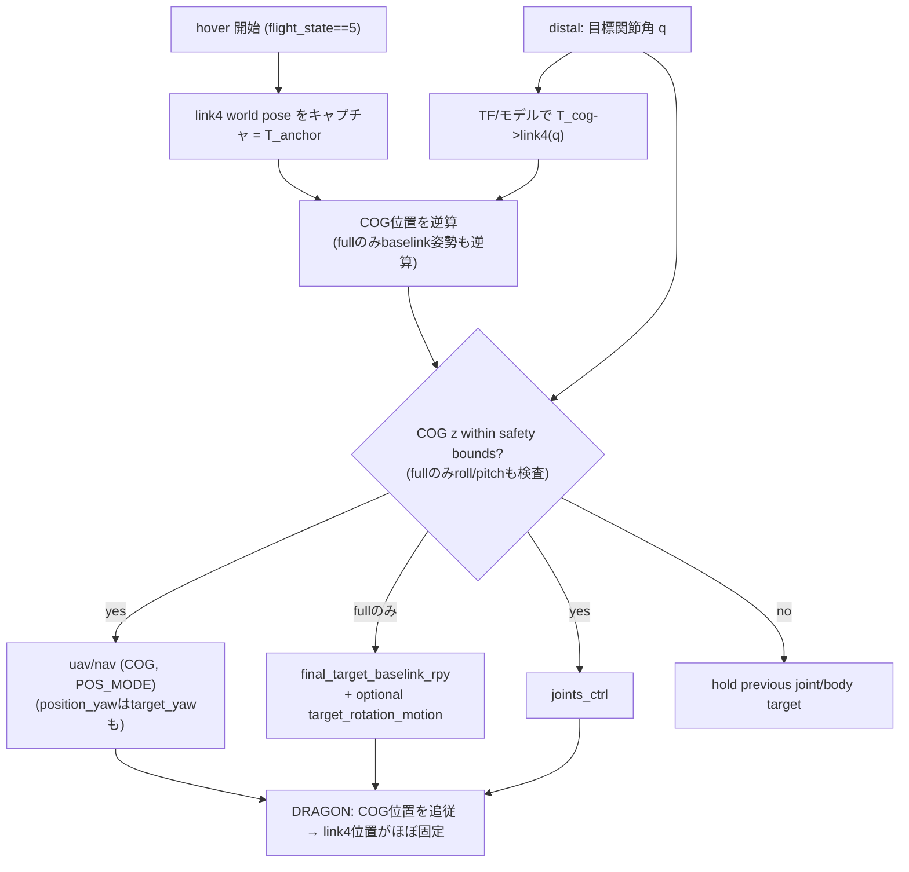

# distal の link4 アンカー

> 状態: **実装済み・実験機能**（[../scripts/control/control_joint_angle.py](../scripts/control/control_joint_angle.py)
> `update_link4_anchor`）。関節操作時に DRAGON の **link4（腕先端側）の位置をワールドにおおよそ固定**
> するため、`joints_ctrl` と同じ目標関節角から link4 の相対位置を先に計算し、COG 位置を
> 同周期で補償する。既定は `link4_anchor_mode:=position_yaw` で、COG yaw 目標
>（`uav/nav` の `target_yaw`）を併用して link4 の位置＋yaw を固定する
>（roll/pitch は通常の姿勢制御のまま。baselink RPY は送らない）。
> `link4_anchor_mode:=position_only` では yaw 固定を行わず COG 位置だけを補償する。
> `link4_anchor_mode:=full` では link4 姿勢まで補償するが、姿勢failsafeや高度低下に直結しやすいため
> 明示指定時のみ使う。機能全体は既定 ON（`enable_link4_anchor:=true`）。
> `link4_anchor_offset_x` で固定点を link4 x軸方向にずらせる（リンク長 0.474 で尾端固定）。

## 背景・目的

distal は人間の腕関節を DRAGON 各関節へ絶対角で写像するが、`joints_ctrl` は**相対形状しか
決めない**。実飛行でどのリンクが世界に止まるかは「COG 位置保持 ＋ baselink(link2) 姿勢保持」で
決まり、既定では**運動学ルートの link1 側が止まって見える**（[../README.md](../README.md) 形状制御節 / 02_robot_model）。

操縦の直感としては、**腕先端側 link4 を基準**にし、手首を曲げれば link1 が振れ、肩を曲げれば
link1〜3 が振れる挙動が望ましい。

ただし、`position_only`（COG位置だけの補償）が満たすのは手首側だけである点に注意。
「並進は link4 基準・回転は baselink(link2) 基準」と基準フレームが分裂しているため、
関節ごとの実際の見え方は次のようになる（baselink 姿勢保持を前提とした幾何解析）:

| 操作 | 望ましい見え方 | position_only の実挙動 |
| --- | --- | --- |
| 手首 (joint1) | link1 が振れる | link1 が振れる（一致） |
| 肘 (joint2) | link1〜2 が動く | link1〜2 は平行移動、link3〜4 がアンカー周りに回転 |
| 肩 (joint3) | link1〜3 が振れ link4 静止 | **link1〜3 は完全静止、link4 だけが回転**（逆転） |

肩・肘でも腕らしく見せるには link4 の**姿勢（少なくとも yaw）**の固定が必要である。
このため `position_yaw` モードを追加した: link4 の位置＋yaw を固定し、yaw は
`uav/nav` の COG yaw 目標として送る。yaw はマルチロータの自由自由度なので
roll/pitch 補償（full モード）のような姿勢failsafe・重力補償との衝突がなく、
baselink 回転のスルーレート制限経路も通らない。水平面（yaw軸）の関節操作では
「肩を曲げると link1〜3 がアンカーを支点に振れる」が正しく実現される。
pitch軸の関節操作では position_only と同じ挙動に留まる（link4 がピッチ回転する）。

別の安価な選択肢として `link4_anchor_offset_x` がある。固定点を link4 尾端
（`link4_anchor_offset_x:=0.474`）にすると、姿勢指令ゼロのまま肩操作で link1〜3 が
平行移動して「頭側が動く」見え方になる（肩支点の回転にはならない）。

link4姿勢まで完全固定（full）しようとすると baselink姿勢を大きく動かす必要があり、
飛行安定性と衝突しやすい。

## 決定事項（実装に反映済み）

1. **distal の実験機能**として `control_joint_angle.py` 内に実装（別ノードにしない）。
2. **基準（link4 の固定目標姿勢）はホバー開始時にキャプチャ**する。
   - `flight_state == 5`（HOVER_STATE）への遷移時に、その時点の link4 world pose を記録。
   - `~recapture_anchor`(std_msgs/Empty) で再キャプチャ可能。ホバリングを抜けると基準は破棄し次のホバーで再取得。
3. **標準は位置＋yaw固定**（roll/pitch は通常制御のまま）。
   - `link4_anchor_mode:=position_yaw`（既定）では COG 位置に加えて `uav/nav` の `target_yaw`（COG yaw, POS_MODE）で
     link4 yaw も固定する。roll/pitch は通常制御のままで、baselink RPY はpublishしない。
   - `link4_anchor_mode:=position_only` では `uav/nav` の COG 位置だけを補償し、yaw 固定は行わない。
   - `link4_anchor_mode:=full` では旧来の6DoF寄り補償として COG位置 + baselink姿勢を補償する。
   - `link4_anchor_offset_x` で固定点を link4 x軸方向にオフセットできる（既定 0.0 = link4原点 = joint3側）。
4. **危険なbody補償は送らない**。
   - `max_step` と body step scaling 後に、position_only / position_yaw では予測COG高度とホバー開始時COGからの水平距離、full ではさらにbaselink roll/pitchを検査する。
   - 安全域外なら `joints_ctrl` も body 補償も直前姿勢で保持する。
   - TFが取得できず補償目標を計算できない周期も、fail-safeとして直前姿勢を保持する。
   - `/target_rotation_motion` への即時姿勢指令は full モードでも既定OFF。

## DRAGON 制御の前提（確認済み）

- 位置制御点は **COG**（[../../../aerial_robot_control/src/flight_navigation.cpp](../../../aerial_robot_control/src/flight_navigation.cpp) は位置目標を COG として扱う）。
- `/<robot>/uav/nav` は DRAGON の `HOVER_STATE == 5` でのみ受理される。`LAND_STATE` や
  DRAGON独自の `PRE_LAND_STATE` 中は nav が無視され、link4アンカーは成立しない。
- position_only では姿勢は通常の DRAGON 側制御に任せ、Dracomancer から link4固定用の baselink RPY は送らない。
- position_yaw の yaw 指令は `uav/nav` の `target_yaw` を使う。これは基底クラス
  [flight_navigation.cpp](../../../aerial_robot_control/src/flight_navigation.cpp) の `naviCallback` が
  **COG フレームの yaw 目標**として処理する（DRAGON 側でのオーバーライドなし・スルーレート制限経路も通らない）。
- full では **baselink = link2(`fc`)** 姿勢も補償する。さらに `enable_baselink_roll_mapping` が有効なら、
  上腕ロールと前腕ロールの中立値からの差分和を、逆算した baselink roll に加算する。
- full では互換・可視化用に `/<robot>/final_target_baselink_rpy`(Vector3Stamped, [r,p,y])
  をpublishする。さらに `/<robot>/target_rotation_motion`
  (nav_msgs/Odometry, `header.frame_id=baselink`) で絶対姿勢を即時指令する経路もあるが、
  姿勢failsafeへ近づきやすいため既定OFF（`publish_link4_anchor_baselink_motion:=false`）。
- `final_target_baselink_rpy` 単独では baselink 姿勢にスルーレート制限が入る
  （`baselink_rot_change_thresh`≈0.04 / `baselink_rot_pub_interval`≈0.2s → 約 0.2 rad/s）ため、
  関節変形に対するlink4固定補償が後れる。
- baselink を link4 に変えるのは不可（IMU/FC が物理的に link2 にある）。
- **DRAGON コア改造は不要**。Dracomancer 側で nav + joints を協調送信する。full モードのみ baselink_rpy も送る。

## 制御の考え方

link4 のワールド位置を基準 `T_anchor`（ホバー開始時キャプチャ）に保つよう、毎周期 COG 位置を
補償指令する。目標関節角 `q`（distal が算出）に対し、モデル/TF から `T_cog→link4(q)` を得て：

```text
# 全モード共通: 固定点は link4原点 · T(link4_anchor_offset_x) （キャプチャ側もFK側も同じオフセット）

COG_world.p = p_anchor - R_world→cog(current) · p_cog→link4(q) # position_only
joints_ctrl = q                                # 形状

# link4_anchor_mode:=position_yaw のみ:
yaw_cmd     = yaw( T_anchor · T_cog→link4(q)^{-1} )   # full解のyaw成分
COG_world.p = p_anchor - R(roll_cur, pitch_cur, yaw_cmd) · p_cog→link4(q)
uav/nav     = COG位置(POS_MODE) + target_yaw=yaw_cmd(POS_MODE)

# link4_anchor_mode:=full のみ:
COG_world      = T_anchor · T_cog→link4(q)^{-1}
baselink_world.M = T_anchor.M · R_baselink→link4(q)^{-1}
baselink_roll   += sum(upper_arm_roll_delta, forearm_roll_delta)
```

position_only / position_yaw では `joints_ctrl` と `uav/nav` を安全ゲート通過時だけ**同時送信**する。実装では `T_anchor` を TF（`world`→`<robot>/link4`）から取得し、
`T_baselink→link4(q)` は DRAGON v1/v1.5 の最小FK（`fc` 固定先の link2 から joint2/joint3 をたどる）で
`joints_ctrl` と同じ目標関節角から計算する。`T_cog→link4(q)` は現在TFの `cog→fc` と目標FKの
`fc→link4(q)` を合成する近似とする。position_only のCOG位置は現在TFの `world→cog` 姿勢を使って
「現在の姿勢のまま link4 位置だけを基準位置へ置く」ように解く。
position_yaw では yaw を full解のyaw成分（`yaw_cmd`）に置き換え、現在roll/pitch＋指令yawの姿勢で
同様にCOG位置を解いたうえで、`uav/nav` の `target_yaw` も同時に送る。
形状は `max_step` で緩やかに変わるが、link4 補償は現在 link4 TF の後追いではなく、目標形状への
フィードフォワードとして行う。
`enable_link4_anchor_body_step_scaling` が有効な場合、`max_step` 適用後の候補姿勢が必要とする
COG位置目標の変化量を予測し、`link4_anchor_max_body_pos_rate` を超えると関節ステップ全体を縮小する。
full モードでは baselink姿勢目標の変化量、position_yaw モードでは COG yaw 目標の変化量も
`link4_anchor_max_body_rpy_rate` で抑える。これにより、
形状変化の速さをbody補償が追従できる範囲へ合わせる。
position_yaw ではさらに `link4_anchor_max_abs_yaw_delta` により、COG yaw 目標をホバー開始時の
COG yaw からの差分で制限する。これはposition_yawを維持しつつ、link4固定のためのyaw指令が
大回りして姿勢制御を巻き込むことを避けるためである。
さらに `enable_link4_anchor_body_safety` が有効な場合、縮小後の候補が必要とする
COG高度とホバー開始時COGからの水平距離を検査する。full モードでは baselink roll/pitch も絶対値で検査する。
`link4_anchor_min_cog_z` を下回る、`link4_anchor_max_cog_z` を超える、`link4_anchor_max_cog_xy_offset`
を超える、または full モードで `link4_anchor_max_abs_roll` / `link4_anchor_max_abs_pitch` を超える場合、その候補姿勢は採用せず
直前の関節姿勢を保持し、拒否されたbody補償はpublishしない。
`enable_link4_anchor_tracking_safety` が有効な場合は、現在のCOG位置・yaw・roll/pitchがlink4アンカー目標へ
追従できていない周期でも候補姿勢を保持する。`enable_link4_anchor_joint_tracking_safety` が有効な場合は、
DRAGONの実関節が `joints_ctrl` に追従していない周期でも候補姿勢を保持する。どちらも、body補償だけが先行して
姿勢failsafeへ近づくことを避けるためのガードである。
同一制御周期内の step scaling / safety gate / nav publish は、周期先頭で更新した同じ TF を使う。
キャプチャ直後の初回補償は、現在TFの `cog→fc` と目標FKを使うため、通常は現在姿勢に近い指令から始まる。



SVG版の全体図は [../figures/link4_anchor_algorithm.svg](../figures/link4_anchor_algorithm.svg) を参照。

## 注意点・限界（完全静止不要なので許容）

- position_only は link4 の姿勢までは固定しない。操縦直感を合わせるための「link4位置基準」の補償である。
  肩(joint3)操作では link1〜3 が世界静止のまま link4 だけが回転する点に注意（背景・目的の表を参照）。
- position_yaw の yaw_cmd は full解の RPY 分解から取るため、cog→link4 のピッチが ±90° 近傍になる
  形状では yaw が退化して跳びうる。その場合は body step scaling が関節ステップを縮小して
  実質的に保持側へ倒れる（保守側）。
- position_yaw の DRAGON 実機・シミュレータでの yaw 追従品質は未計測（要シミュレーション確認）。
- full モードは baselink姿勢のスルーレート制限で、速い関節操作時は link4 が一時的にズレ、遅れて追従する。
- full モードで補償姿勢が大きいとベクタリングのフィージビリティ限界や姿勢failsafeに当たる。既定では position_yaw とし、full は明示指定時だけ使う。
- 位置制御を使う必要がある。既存 `enable_position_control` の経路は `POS_VEL_MODE`＋`target_pos`
  未設定で落下するバグがあるため（[../README.md](../README.md) 既知の課題）、本機能は**絶対 COG 位置
  (POS_MODE)** を送る別ロジックで実装する。
- 操縦桿による移動（control_position）と同時利用すると、両者が `uav/nav` を書いて競合する。
  本機能 ON 時は移動制御（`enable_position_control`）を OFF にすること（移動制御は既定で OFF）。

## パラメータ（control_joint_angle）

| param | 既定 | 説明 |
| --- | --- | --- |
| `~enable_link4_anchor` | `true` | distal 時に link4 アンカーを有効化する |
| `~link4_anchor_mode` | `position_yaw` | `position_only`: link4位置だけをCOG位置で補償 / `position_yaw`: COG位置+COG yaw目標でlink4位置とyawを補償 / `full`: COG位置+baselink姿勢でlink4姿勢も補償 |
| `~anchor_link` | `link4` | 固定するリンク名（`<robot>/<anchor_link>`） |
| `~link4_anchor_offset_x` | `0.0` | 固定点の link4 x軸方向オフセット [m]。`0.474`（リンク長）で尾端を固定 |
| `~world_frame` | `world` | アンカー基準のワールドフレーム |
| `~cog_frame` / `~baselink_frame` | `<robot>/cog` / `<robot>/fc` | COG・baselink の TF フレーム |
| `~nav_topic` / `~baselink_rpy_topic` | `/<robot>/uav/nav` / `/<robot>/final_target_baselink_rpy` | 出力先 |
| `~baselink_motion_topic` / `~publish_baselink_motion` | `/<robot>/target_rotation_motion` / `false` | full モード用のbaselink即時姿勢指令。姿勢failsafeへ近づきやすいため既定OFF |
| `~enable_link4_anchor_body_step_scaling` | `true` | body目標の必要変化量に基づいて関節ステップを自動縮小 |
| `~link4_anchor_max_body_pos_rate` / `~link4_anchor_max_body_rpy_rate` | `0.15` / `0.25` | body step scalingで許容するCOG位置・姿勢目標の最大変化速度。姿勢側はfullのbaselink姿勢、またはposition_yawのCOG yaw |
| `~enable_link4_anchor_body_safety` | `true` | body補償後のCOG高度を検査し、安全域外なら直前姿勢を保持。fullモードではbaselink姿勢も検査 |
| `~link4_anchor_max_abs_roll` / `~link4_anchor_max_abs_pitch` | `0.6` / `0.6` | fullモードのbody補償で許容するbaselink roll/pitch絶対値 [rad] |
| `~link4_anchor_min_cog_z` / `~link4_anchor_max_cog_z` | `0.6` / `2.5` | body補償で許容するCOG高度範囲 [m]。max `0.0` は上限無効 |
| `~link4_anchor_max_cog_xy_offset` | `0.5` | ホバー開始時COGから許容する水平距離 [m]。`0.0` 以下で無効 |
| `~link4_anchor_max_abs_yaw_delta` | `1.047` | position_yawのCOG yaw目標をホバー開始時COG yawからの差分で制限する上限 [rad]。`0.0` 以下で無効 |
| `~enable_link4_anchor_tracking_safety` | `true` | COG/yaw/roll/pitch追従誤差が大きい時に候補姿勢を保持 |
| `~link4_anchor_max_cog_tracking_error` / `~link4_anchor_max_yaw_tracking_error` | `0.2` / `0.349` | COG位置目標・COG yaw目標に対する許容追従誤差 |
| `~link4_anchor_max_tracking_roll` / `~link4_anchor_max_tracking_pitch` | `0.262` / `0.262` | link4アンカー中に許容する実roll/pitch絶対値 [rad] |
| `~enable_link4_anchor_joint_tracking_safety` | `true` | DRAGON実関節が`joints_ctrl`へ追従していない時に候補姿勢を保持 |
| `~link4_anchor_max_joint_tracking_error` / `~link4_anchor_joint_tracking_timeout` | `0.3` / `0.5` | DRAGON関節の許容追従誤差 [rad] と関節状態の最大経過時間 [s] |
| `~enable_baselink_roll_mapping` | `true` | fullモード時に上腕ロール+前腕ロールの差分和をbaselink rollへ加算 |
| `~baselink_roll_source_joints` / `~baselink_roll_signs` / `~baselink_roll_scales` | `[upper_arm_external_internal_rotation_joint, wrist_supination_joint]` / `[-1,-1]` / `[1,1]` | baselink roll 差分の入力・符号・ゲイン |
| `~baselink_roll_limit` | `pi/2` | baselink roll へ加算する差分の絶対値上限 [rad] |
| `~dragon_link_length` / `~dragon_inter_joint_x_offset` / `~dragon_link2_fc_xyz` | `0.474` / `0.02575` / `[0.3245, -0.0010, 0.0280]` | link4 アンカー用の最小 DRAGON FK パラメータ |
| `~hover_flight_state` | `5` | DRAGON の HOVER_STATE。link4アンカー補償を出す flight_state |
| `~recapture_anchor`(Empty) | – | 基準の再キャプチャ要求 |

## 残課題 / TODO

- 実機（Gazebo）での再確認（ズレ量、追従、安全ゲートの保持動作）。
- z（高度）・link4位置ズレ量の追従品質確認。
- 移動制御（操縦桿）との両立（uav/nav の合成）。
- 必要なら COG 変化も含むモデルFK（aerial_robot_model）に切替えて、位置補償の精度を上げる。
