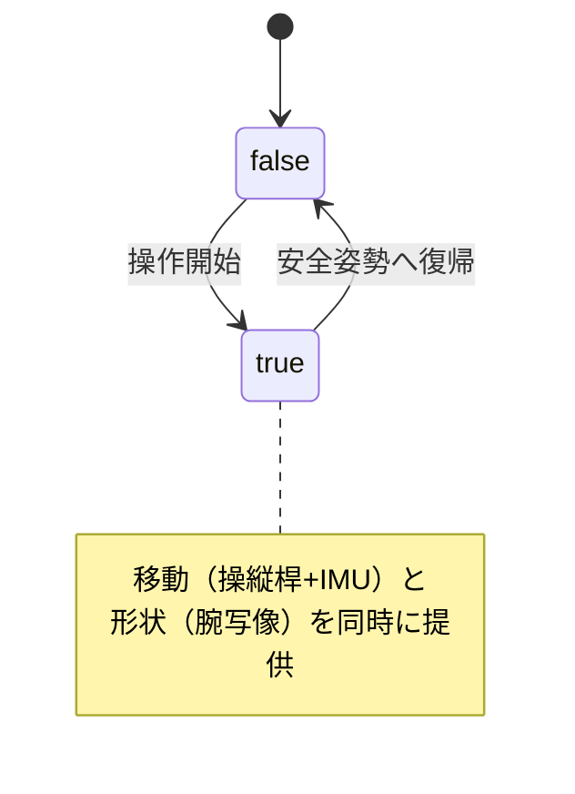

# Dracomancer 要件定義書（雛形）

> この文書は Dracomancer の**要件定義**です。研究目的（低い認知負荷・身体的負担での多関節飛行ロボットの直感的接触作業）から各要件を導出し、設計・実装・評価が追跡できるようにすることを狙います。
> 未確定の項目は `TBD`（To Be Determined）として残しています。確定したら値・根拠・出典を埋め、関連する [README.md](../README.md) / [docs/ideas.md](ideas.md) と整合させてください。
> 要件IDの体系: `FR-*`（機能要件） / `NFR-*`（非機能要件） / `HW-*`（ハードウェア要件） / `IF-*`（インタフェース要件） / `SR-*`（安全要件）。

## 0. 文書管理

| 項目 | 内容 |
| --- | --- |
| 対象システム | Dracomancer（上肢外骨格型遠隔操作デバイス＋操作変換システム） |
| 操縦対象 | 一般の多関節飛行ロボット（実装上の主対象は DRAGON、候補に HYDRUS） |
| 版数 | 0.1（雛形） |
| 最終更新 | 2026/06/27 |
| 作成者 | Tomoya Oku |
| 関連文書 | [README.md](../README.md)（システム仕様）、[docs/ideas.md](ideas.md)（研究アイデア）、ルート/パッケージ `AGENTS.md` |

## 1. 目的とスコープ

### 1.1 目的

低い認知負荷および身体的負担で、多関節飛行ロボットを用いた**直感的な接触作業**を実現する遠隔操作システムを開発する。本書はそのために満たすべき要件を定義する。

### 1.2 スコープ

| 区分 | 含む | 含まない |
| --- | --- | --- |
| デバイス | 上肢外骨格ハードウェア、背中IMU、操縦桿、子機PC、Spinal | 飛行ロボット本体の機体設計 |
| ソフトウェア | 操作変換・形状安全・力覚提示の各ノード | 飛行ロボットの飛行制御・自己位置推定 |
| 操作対象 | 多関節飛行ロボット一般（検証は DRAGON 中心） | 従来型マルチロータ単体の操作 |

### 1.3 用語

| 用語 | 定義 |
| --- | --- |
| Dracomancer | 上肢外骨格型遠隔操作デバイスの呼称 |
| DRAGON / HYDRUS | 操縦対象とする多関節飛行ロボット |
| 多関節飛行ロボット | 複数リンクが関節で連結された空中ロボットの総称（本研究の対象） |
| Force/Torque Volume | 機体が発揮可能な力・トルクの集合。その内接半径 `fc_f_min` / `fc_t_min` を安全指標に使う |
| teleop_mode | 操作モード。`false` / `true` |

## 2. ステークホルダーと利用者

| 区分 | 想定 | 主な関心 |
| --- | --- | --- |
| 操縦者 | 接触作業を行う作業者 | 直感性、低負担、安全性 |
| 開発者/研究者 | 本研究の実施者 | 拡張性、再現性、評価可能性 |
| 第三者 | 作業現場の周囲の人・設備 | 暴走・落下時の安全 |

## 3. 前提・制約条件

| ID | 区分 | 内容 |
| --- | --- | --- |
| CON-1 | 計算機 | 親機PC: Ubuntu 22.04 / ROS1 Noetic。子機PC: Khadas VIM4（背中搭載） |
| CON-2 | 通信 | ROS master は親機PCに固定。子機との間は無線LAN想定（帯域・遅延は TBD） |
| CON-3 | マイコン | Spinal（STM32H7_v2）経由でサーボ・IMUを接続 |
| CON-4 | アクチュエータ | Mk-I は DYNAMIXEL XL430-W250-T ×7。**電流/トルク指令には非対応**（トルク ON/OFF のみ） |
| CON-5 | 表示環境 | 子機は表示なし運用が前提（RViz は既定で起動しない、`headless`） |
| CON-6 | 編集範囲 | 実装変更は原則 `robots/dracomancer/` 内に限定 |
| CON-7 | 操縦対象前提 | 形状安全予測は操縦対象（DRAGON）のモデル起動を前提とする |

## 4. 機能要件（FR）

操作モードと研究の三本柱（広域移動・精密動作・力覚提示）に沿って定義する。`実装`列は現状の達成度（実装済 / 部分 / 未）を示す。

操作モードは `false` と `true` の2つ。**広域移動（操縦桿移動）と精密動作（腕形状写像）は別モードではなく、`teleop_mode=true` の中で同時に有効な機能**とする。すなわち操縦者は `teleop_mode=true` で、操縦桿による機体移動と腕形状による機体変形を並行して行える。

### 4.1 操作モード

| ID | 要件 | 受け入れ基準（案） | 実装 |
| --- | --- | --- | --- |
| FR-1 | `false` / `true` の2モードを持つ | 各モードに遷移でき、`true` では移動と形状制御が同時に有効 | 実装済 |
| FR-2 | 実行中にモードを切り替えられる | `/<device>/teleop_mode`(`Bool`) で `false`/`true` を切替 | 実装済 |
| FR-3 | 離陸時は人体形状写像を切り離した安全姿勢を保持する | `teleop_mode=false` で `startup_pose` を保持し落下しない | 実装済 |

### 4.2 広域移動機能（`teleop_mode=true` で有効）

| ID | 要件 | 受け入れ基準（案） | 実装 |
| --- | --- | --- | --- |
| FR-4 | 操縦桿入力を機体の移動指令へ変換する | `teleoperation` かつホバリング時に `FlightNav` を送出 | 実装済 |
| FR-5 | 操縦者の身体方向（背中IMU）に対する相対方向で移動方向を補正する | `direction_mode` で `none/yaw/yaw_pitch/full` を切替 | 実装済 |
| FR-6 | IMU yaw ドリフトに対し中立姿勢を再キャプチャできる | 起動時/ホバ時/手動トリガで中立更新 | 実装済 |
| FR-7 | 作業領域外への移動を抑制する | 境界外へ向かう速度成分を0にする | 実装済 |
| FR-8 | （発展）腕動作から移動意図を推定する | TBD（機械学習の要否含め未定） | 未 |

### 4.3 精密動作機能（`teleop_mode=true` で有効）

| ID | 要件 | 受け入れ基準（案） | 実装 |
| --- | --- | --- | --- |
| FR-9 | 腕関節を多関節飛行ロボットの形状指令へマッピングする | `joints_ctrl` を送出し、腕の面内曲げが機体形状に反映 | 実装済 |
| FR-10 | 複数のマッピング方式を切り替え・比較できる | `joint_pairing` / `geometric` を選択可能 | 実装済 |
| FR-11 | 不可能（飛行不可）姿勢への変形を防ぐ | 予測フィージビリティ・ゲートで採否を判定 | 実装済 |
| FR-12 | 不可行候補時の挙動を選べる | `hold` / `step_search` / `soft_scale` | 実装済 |

### 4.4 力覚提示（haptics）

| ID | 要件 | 受け入れ基準（案） | 実装 |
| --- | --- | --- | --- |
| FR-13 | 形状抑制量から提示量を算出する | 抑制差から提示トルク相当量を計算・publish | 実装済 |
| FR-14 | 安全余裕の低下を操縦者へ提示する | Mk-I: 該当関節のトルク ON/OFF で警告 | 部分 |
| FR-15 | 接触反力・反トルクを連続的に提示する | TBD（Mk-II の連続トルク提示で達成予定） | 未 |
| FR-16 | 提示の数学的自由度を明確化する | 何自由度まで提示可能かを定式化（**研究上重要**） | 未 |

## 5. 非機能要件（NFR）

| ID | 区分 | 要件 | 指標・目標値 |
| --- | --- | --- | --- |
| NFR-1 | 直感性 | 低認知負荷で操作できる | NASA-TLX 等の主観評価 ≤ TBD |
| NFR-2 | 身体負担 | 長時間装着で過度な負担がない | 装着重量・連続装着時間 TBD |
| NFR-3 | 応答性 | 操作入力から機体指令までの遅延が小さい | エンドツーエンド遅延 ≤ TBD ms |
| NFR-4 | 制御周期 | 各制御ノードが安定周期で動作する | 形状評価 20 Hz（`feasibility_rate`）等 |
| NFR-5 | 透明性 | 力覚提示により作業の透明性が向上する | 反力推定と提示の対応 TBD |
| NFR-6 | 汎用性 | 特定機体に依存せず多関節飛行ロボットへ適用できる | DRAGON 以外（HYDRUS）への適用検討 |
| NFR-7 | 保守性 | 変更が `dracomancer/` 内に局所化される | 共通パッケージ改変なしで機能追加 |
| NFR-8 | 再現性 | シミュレーションで評価条件を再現できる | sim で実験条件を再構成可能 |

## 6. ハードウェア要件（HW）

| ID | 要件 | 現状 / 目標 |
| --- | --- | --- |
| HW-1 | 操縦者上肢の主要関節角を取得する | 7関節サーボで取得（Mk-I 実装済） |
| HW-2 | 操縦者の身体姿勢を計測する | 背中IMU（取付角の再現性が要） |
| HW-3 | 移動入力デバイスを備える | グリップ部の操縦桿 |
| HW-4 | 力覚提示に十分な関節トルク・可動域を確保する | Mk-I は ON/OFF。Mk-II で連続トルク対象関節を強化（肩・肘優先） |
| HW-5 | リンク長を操縦者に合わせて調整できる | Mk-II でインデックスプランジャ採用 |
| HW-6 | 脱力・非常停止時に装着者を拘束しすぎない | 機械ストッパとソフトリミットを分離（Mk-II 設計要件） |
| HW-7 | 装着のためのベースウェアを備える | 背中・腰でデバイスを固定（Mk-I 実装済） |

> ハードウェアデザインとシステム仕様の兼ね合いを常に検討すること（どの関節に力覚提示を割り当てるか等）。

## 7. インタフェース要件（IF）

| ID | インタフェース | 型 | 備考 |
| --- | --- | --- | --- |
| IF-1 | 操縦桿生値 → 較正値 | `Int16MultiArray` → `Float32MultiArray` | `/joystick/raw` → `/<dev>/joystick/calibrated` |
| IF-2 | サーボ状態 → 関節角 | `spinal/ServoStates` → `JointState` | `/<dev>/servo/states` → `/<dev>/joint_states` |
| IF-3 | 操縦者IMU | `spinal/Imu`（quat `[x,y,z,w]`） | `/<dev>/imu` |
| IF-4 | 移動指令 | `aerial_robot_msgs/FlightNav` | `/<robot>/uav/nav` |
| IF-5 | 形状指令 | `sensor_msgs/JointState` | `/<robot>/joints_ctrl` |
| IF-6 | 形状フィージビリティ予測 | service `check_shape` | `fc_f_min` / `fc_t_min` を返す |
| IF-7 | 力覚提示出力 | `JointState` / `ServoTorqueCmd` / `ServoControlCmd` | ON/OFF 既定、電流指令は任意 |
| IF-8 | しきい値設定 | `Float64MultiArray`（`[hard_min, min]`） | force/torque 各々 |

> 詳細トピック表は [README.md](../README.md) を参照。本書では契約として満たすべきインタフェースのみを定義する。

## 8. 安全要件（SR）

| ID | 要件 | 実現手段 | 実装 |
| --- | --- | --- | --- |
| SR-1 | 飛行不可となる機体形状への変形を未然に防ぐ | 予測フィージビリティ・ゲート | 実装済 |
| SR-2 | ホバリング以外では位置・姿勢・形状指令を出さない | 送信ゲート（`publish_*_when_hovering`） | 実装済 |
| SR-3 | 形状安全余裕を監視・可視化する | ライブ監視（安全スケール publish） | 実装済 |
| SR-4 | 1周期あたりの指令変化量を制限する | `max_step` によるレート制限 | 実装済 |
| SR-5 | 安全しきい値を実行時に変更できる | しきい値 `_cmd` トピック | 実装済 |
| SR-6 | 力覚提示・サーボ脱力が操縦者を危険にさらさない | 非常停止時の脱力挙動を定義（Mk-II） | TBD |

## 9. 評価・受け入れ基準

研究目的の達成を測る評価軸。詳細な実験計画は別途。

| 評価軸 | 指標（案） | 関連要件 |
| --- | --- | --- |
| 直感性・負担 | NASA-TLX、習熟時間 | NFR-1, NFR-2 |
| 広域移動性能 | 到達時間、経路長、軌道逸脱、入力反転回数 | FR-4〜7 |
| 精密動作性能 | 接触作業成功率、作業時間、最小安全余裕、不可能姿勢進入回数 | FR-9〜12 |
| 力覚提示の効果 | 安全境界の知覚率、作業透明性 | FR-13〜16 |
| 汎用性 | 対象機体を変えた際の再設定コスト | NFR-6 |

## 10. 未確定事項・TODO

| 項目 | 状態 | メモ |
| --- | --- | --- |
| 立ち上げ時のマッピング方式 | 未定 | 円形姿勢への安全な遷移方法 |
| 移動と形状の同時操作 | 設計確定（cog 基準） | `teleop_mode=true` で操縦桿移動と腕形状写像が同時に働く。移動基準は `FlightNav.target=COG`（既定）。形状変化に伴う COG 移動は DRAGON の飛行制御が吸収する前提。実機での過渡挙動は要検証 |
| `wide`/`precision` 廃止に伴う実装更新 | 実装済 | launch 既定値・`control_*.py` のモード分岐・`set_teleop_mode.py`・README/AGENTS を `false`/`true` に統一済み |
| 力覚提示の達成自由度 | 未定 | 数学的定式化が必要（研究上重要） |
| 通信遅延・帯域の目標値 | TBD | 親機-子機間 |
| 装着重量・連続装着時間の上限 | TBD | NFR-2 の定量化 |
| HYDRUS への適用範囲 | 未定 | モデル差分の影響 |
| Mk-II アクチュエータ選定 | 未定 | 電流/トルク制御対応・バックドライバビリティ |

---

> 補足: 各要件には可能な限り**出典（DOI）と定量目標**を付すこと。研究背景で「強レンチが必要」「従来操作が難しい」とした主張は、対応する文献を SR/NFR の根拠として引用する。
