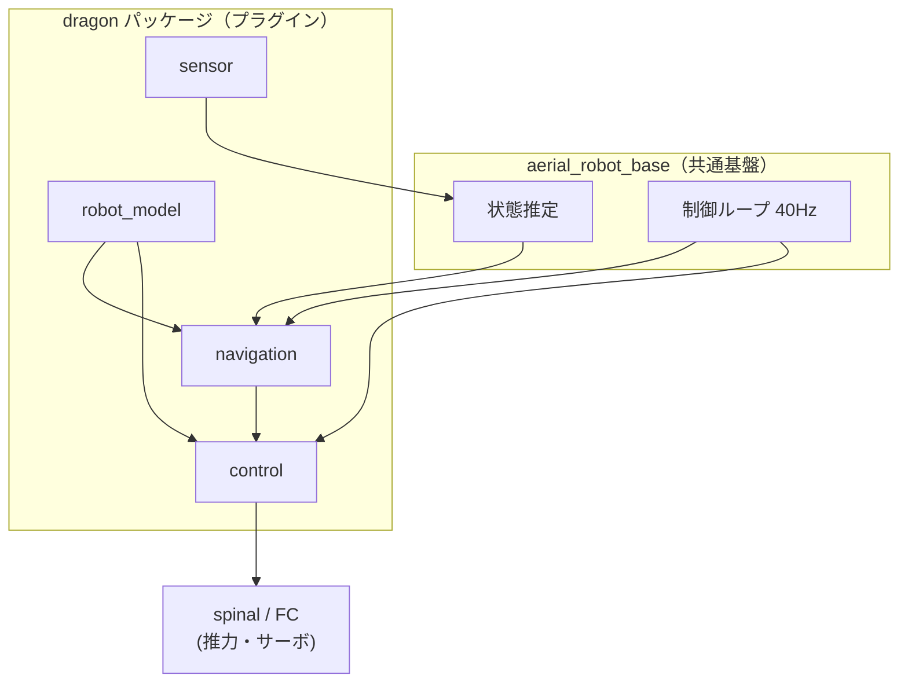
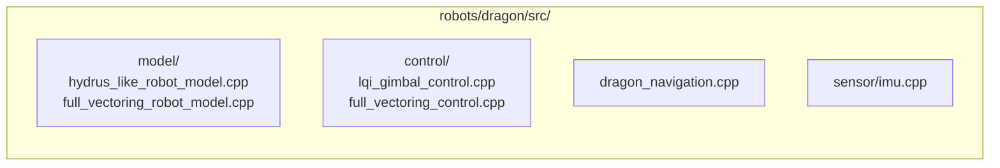
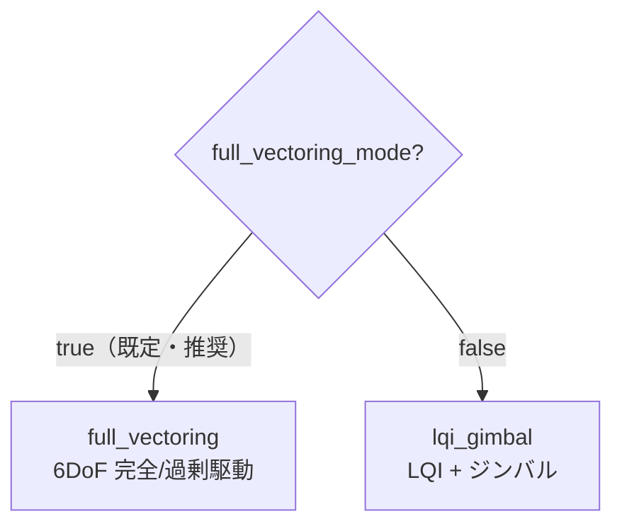

# 01. システム概要

DRAGON は `aerial_robot` フレームワーク上のプラグイン群として実装されています。
`bringup.launch` が各プラグイン（モデル / 制御 / ナビゲーション / センサ）を読み込みます。

## ソフトウェアスタック

## 提供プラグイン一覧

| 種別 | プラグイン名 | 実装クラス | 概要 |
| --- | --- | --- | --- |
| robot_model | `dragon/hydrus_like_robot_model` | `Dragon::HydrusLikeRobotModel` | hydrus 系のベースモデル |
| robot_model | `dragon/full_vectoring_robot_model` | `Dragon::FullVectoringRobotModel` | ジンバルロール最適化付きモデル |
| control | `aerial_robot_control/dragon_lqi_gimbal` | `DragonLQIGimbalController` | LQI（roll/pitch/z）＋ジンバル（x/y/yaw） |
| control | `aerial_robot_control/dragon_full_vectoring` | `DragonFullVectoringController` | 6自由度フルベクタリング制御 |
| navigation | `aerial_robot_navigation/dragon_navigation` | `DragonNavigator` | 離着陸・姿勢・変形のナビゲーション |
| sensor | `sensor_plugin/dragon_imu` | `sensor_plugin::DragonImu` | フルベクタリング用 IMU 処理 |

## ソースコード構成

| ディレクトリ | 主な内容 | 規模感 |
| --- | --- | --- |
| `src/model/` | リンク・ジンバル・推力配置の計算 | full_vectoring ≈ 980 行 |
| `src/control/` | 推力 / ジンバル角度の配分計算 | full_vectoring ≈ 2110 行 |
| `src/dragon_navigation.cpp` | 状態遷移・姿勢・変形指令 | ≈ 396 行 |
| `src/sensor/imu.cpp` | IMU の機体姿勢補正 | ≈ 128 行 |

## 2 つの制御系統

DRAGON には歴史的経緯から 2 つの制御方式があり、`full_vectoring_mode` で切替えます。

詳細は [02. ロボットモデル](02_robot_model.md) / [03. 制御](03_control.md) を参照。
