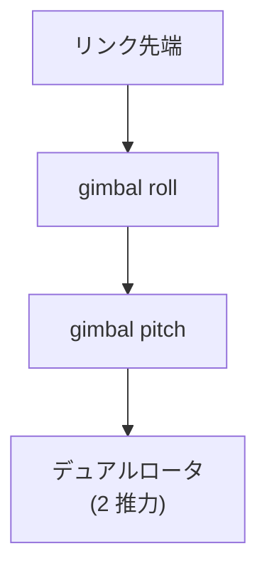
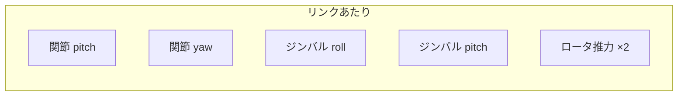
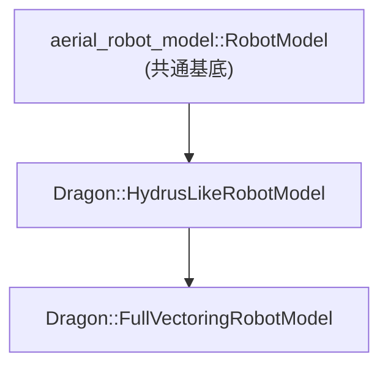
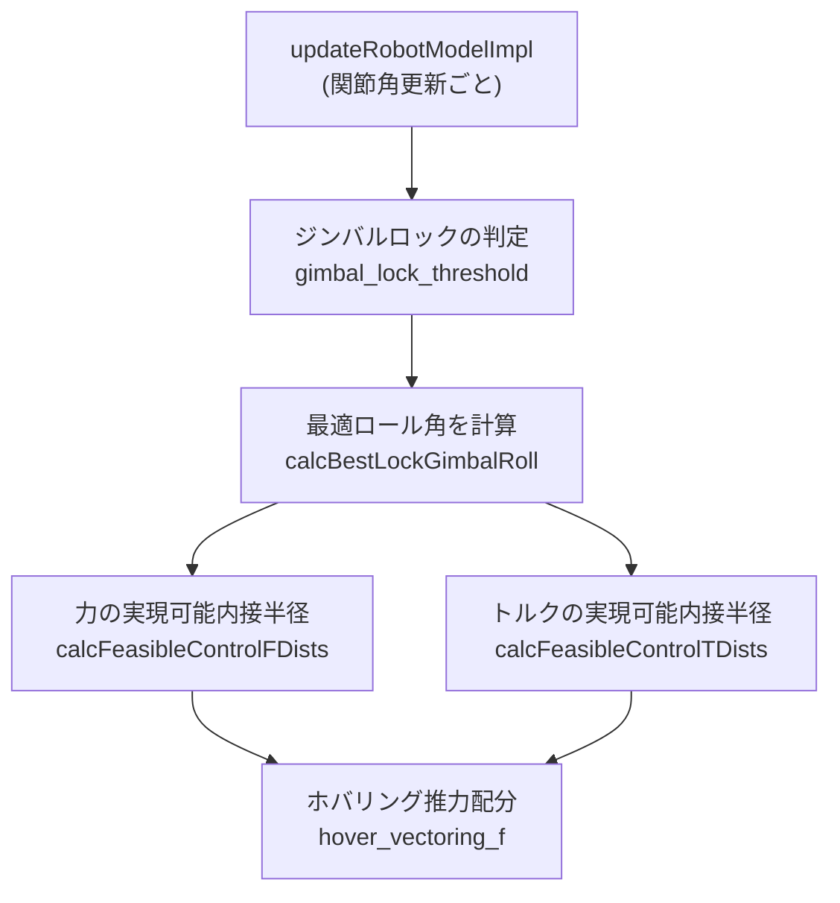

# 02. ロボットモデル

## 機体の物理構造

DRAGON は複数のリンクを 2 自由度関節（pitch / yaw）で直列に連結し、
各リンクの先端に**ジンバル付きデュアルロータ**を搭載します（quad = 4 リンク構成）。

各リンク先端のロータユニット:

主要寸法（`urdf/v1_5/dragon_common.xacro`）:

| パラメータ | 値 | 説明 |
| --- | --- | --- |
| `link_length` | 0.474 m | リンク長 |
| `inter_joint_x_offset` | 0.02575 m | 関節間 X オフセット |
| `gimbal_roll_x_offset` | −0.0065 m | ジンバルロール X オフセット |
| `gimbal_pitch_z_offset` | 0.0265 m | ジンバルピッチ Z オフセット |
| `max_force` / `min_force` | 30 / 2 N | ロータ推力範囲 |

## 関節とアクチュエータの自由度

- **関節（joint pitch/yaw）**: 機体形状（変形）を決める。ナビゲーションから指令。
- **ジンバル（roll/pitch）＋推力**: 制御器が各時刻で配分し、6 自由度の力/トルクを生成。

## モデルプラグインの継承関係

### HydrusLikeRobotModel（基底）

- hydrus 系のリンク連結モデルをベースに、DRAGON のジンバル構造を扱う。
- 主なパラメータ: `fc_rp_min_thre`（roll/pitch 実現可能性しきい値）、`edf_max_tilt`。

### FullVectoringRobotModel（フルベクタリング用）

HydrusLike を継承し、**ジンバルロール角の最適化**と実現可能制御範囲の計算を追加します。

主なパラメータ（`config/.../model/FullVectoringRobotModel.yaml`）:

| パラメータ | 既定 | 説明 |
| --- | --- | --- |
| `gimbal_lock_threshold` | 0.3 rad | ジンバルロール固定を判断するしきい値 |
| `link_att_threshold` | 0.2 rad | リンク姿勢変化のしきい値 |
| `lock_status_change_threshold` | 10 | ロック状態切替の安定化カウント |
| `gimbal_delta_angle` | 0.3 | ロール角探索の刻み |
| `robot_model_refine_max_iteration` | 5 | モデル再計算の最大反復 |
| `min_force_weight` / `min_torque_weight` | 1.0 / 1.0 | 実現可能性最小化の重み |

> **実現可能制御内接半径（feasible control inradius）**は、その形状で安定に発生できる
> 力/トルクの余裕を表し、`/dragon/debug/fc_f_min`・`/dragon/debug/fc_t_min` として公開され、
> Dracomancer 側の形状安全機構にも利用されます。

## モデル構成バリエーション

| 構成名 | 説明 |
| --- | --- |
| `v1_5_202601` | 新モデル（既定。`new_model:=true`） |
| `vim4_202311` | 旧モデル（`new_model:=false`） |

各構成の URDF/xacro は `robots/quad/`、設定は `config/quad/<model_name>/` 配下にあります。
