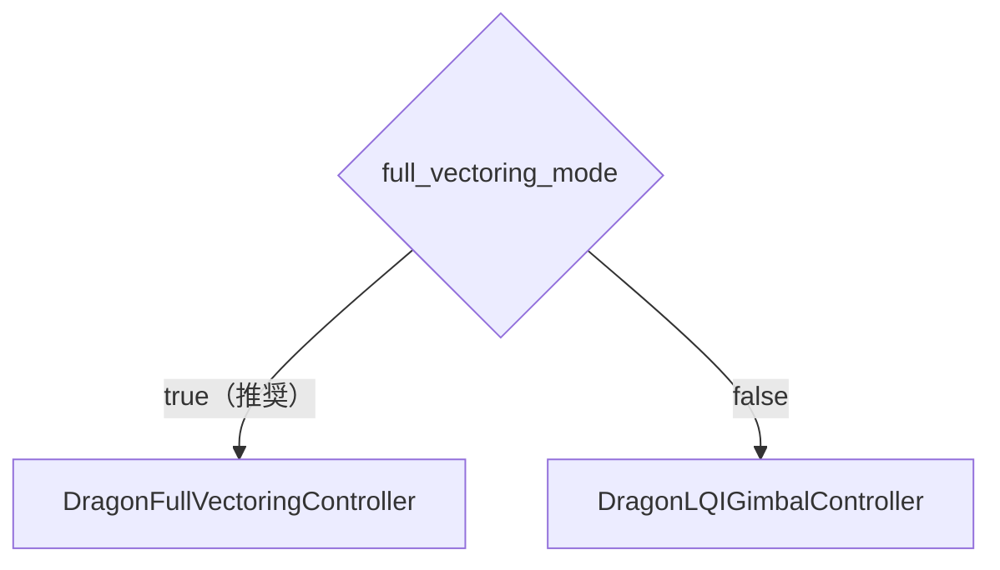
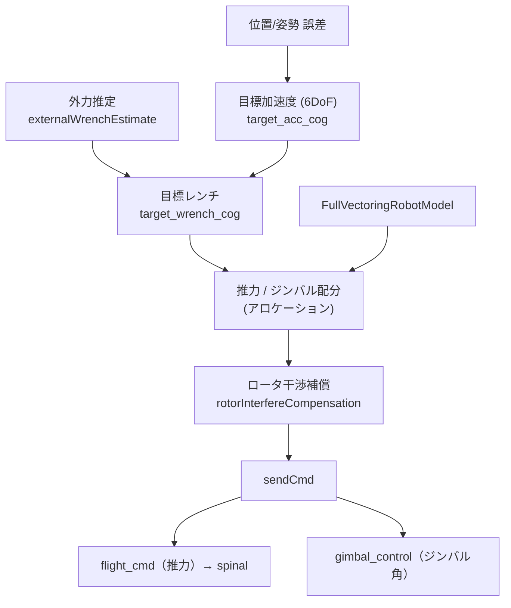
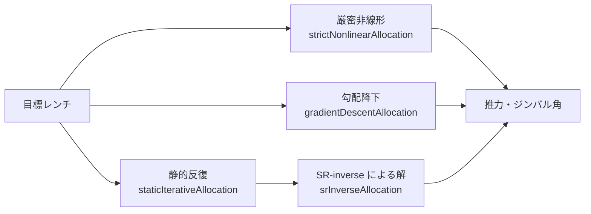
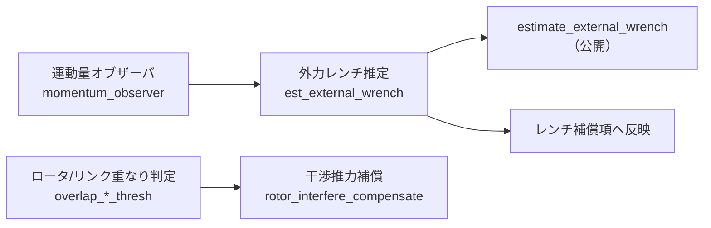
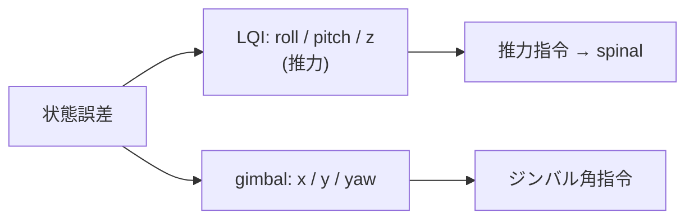

# 03. 制御

DRAGON には 2 つの制御方式があり、`full_vectoring_mode`（既定 true）で選択します。

## フルベクタリング制御（既定）

`DragonFullVectoringController`（`PoseLinearController` を継承）は、
目標 6 自由度加速度／レンチを、**各ロータの推力**と**ジンバル角度**に配分します。

### アロケーション手法（3 種）

目標レンチからアクチュエータ指令を解く方法が 3 つ用意されています。

| 手法 | フラグ | 特徴 |
| --- | --- | --- |
| 静的反復 | `enable_static_allocation_method_` | 反復で擬似逆解を改善 |
| 厳密非線形 | `enable_nonlinear_allocation_method_` | NLopt による非線形最適化 |
| 勾配降下 | `enable_gradient_allocation_method_` | 勾配法 |

### 外力推定とロータ干渉補償

- `addExternalWrench` / `clearExternalWrench` サービスで外力を手動付加（試験用）。
- `extra_vectoring_force` で追加のベクタリング力を注入可能。

### 公開デバッグトピック（抜粋）

| トピック | 説明 |
| --- | --- |
| `target_vectoring_force` | 配分後のベクタリング力 |
| `estimate_external_wrench` | 推定外力レンチ |
| `rotor_interfere_wrench` | ロータ干渉補償レンチ |
| `debug/fc_f_min` / `debug/fc_t_min` | 力 / トルクの実現可能内接半径 |

## LQI ジンバル制御（旧方式）

`DragonLQIGimbalController` は、**roll/pitch/z を LQI**、**x/y/yaw をジンバル**で扱う方式です。
hydrus 系の LQI コントローラを DRAGON のジンバルへ拡張したものです。

## 制御設定ファイル

| ファイル | 用途 |
| --- | --- |
| `control/FullVectoringControlConfig.yaml` | フルベクタリング制御パラメータ |
| `control/LQIGimbalControlConfig.yaml` | LQI ジンバル制御パラメータ |

> シミュレーションでは `controller/rotor_interfere_compensate=false`（ロータ干渉補償オフ）が
> 自動で設定されます。
