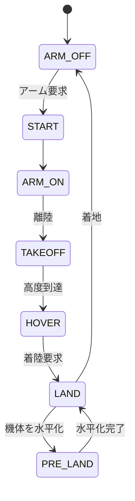
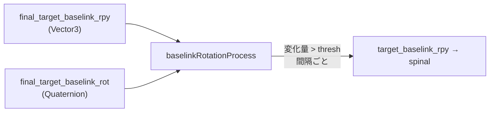
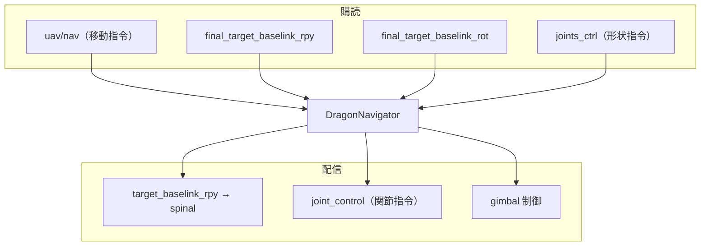
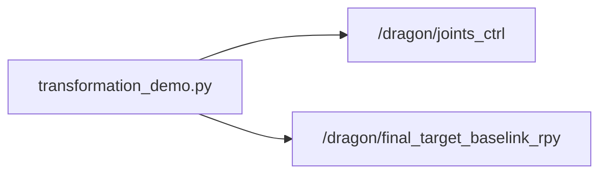

# 04. ナビゲーション

`DragonNavigator`（`BaseNavigator` を継承）は、飛行状態の遷移管理に加え、
DRAGON 特有の **機体姿勢（baselink rotation）制御**・**ジンバル制御**・
**変形時のサーボトルク管理**を担当します。

## フライトステート遷移

- DRAGON 固有の追加状態 **`PRE_LAND_STATE (0x20)`**: 着陸前に機体を水平へ整える。
- 着陸処理では高度 `height_thresh`（既定 0.1 m）以下でサーボトルクを切る。

## 機体姿勢（baselink rotation）処理

DRAGON は変形に応じて重心や姿勢が変わるため、目標 baselink 姿勢を spinal へ送ります。

| パラメータ | 説明 |
| --- | --- |
| `baselink_rot_change_thresh` | 姿勢更新の最小変化量（既定 0.04） |
| `baselink_rot_pub_interval` | 姿勢配信間隔（既定 0.2 s） |

## 入出力トピック

## プリフライト関節制御

`enable_preflight_joint_control`（シミュレーションでは既定 true）が有効なとき、
離陸前から関節指令を反映できます。実機では地上での意図しない変形を防ぐため既定 false。

## 変形デモ

ホバリング後（`Hovering!` 表示後）に `transformation_demo.py` で定型姿勢へ変形できます。

| コマンド | 形状 |
| --- | --- |
| `rosrun dragon transformation_demo.py _mode:=0` | シーホース姿勢 |
| `rosrun dragon transformation_demo.py _mode:=1` | スパイラル姿勢 |
| `rosrun dragon transformation_demo.py _mode:=2` | M 字姿勢 |
| `rosrun dragon transformation_demo.py _reset:=1` | 通常姿勢へ復帰 |
| `rosrun dragon transformation_demo.py _reverse_reset:=1` | 反転通常姿勢 |

## 遠隔操作

| 方法 | 参照 |
| --- | --- |
| キーボード | [wiki: keyboard_operation](https://github.com/JSKAerialRobot/aerial_robot/wiki/keyboard_operation) |
| ジョイスティック | [wiki: joystick_operation](https://github.com/JSKAerialRobot/aerial_robot/wiki/joystick_operation) |
| Dracomancer（外骨格） | [dracomancer/docs](../../dracomancer/docs/README.md) |

主なナビゲーション設定（`NavigationConfig.yaml`）:

| パラメータ | 既定 | 説明 |
| --- | --- | --- |
| `takeoff_height` | 1.0 m | 離陸高度 |
| `max_target_vel` | 0.5 | 目標速度上限 |
| `max_target_yaw_rate` | 0.1 | ヨーレート上限 |
| `xy_control_mode` | 0 | 0=位置, 2=速度(world), 3=速度(local), 4=姿勢 |
