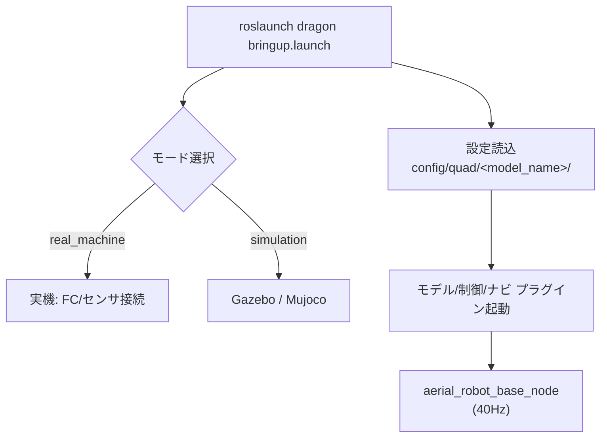
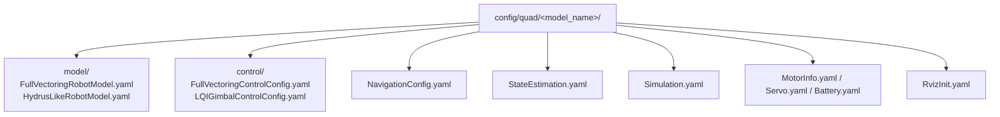
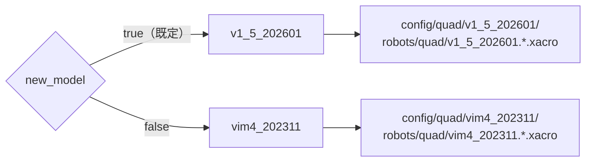

# 05. 起動方法と設定

## 起動フロー



## よく使うコマンド

実機:

```bash
roslaunch dragon bringup.launch
```

> **離陸前にサーボ角を確認**: `rostopic echo -c /servo/states` で異常値（例: 5→4095）が無いかチェック。

シミュレーション:

```bash
roslaunch dragon bringup.launch real_machine:=false simulation:=true headless:=false
# 簡潔版
roslaunch dragon bringup.launch sim:=true headless:=false
```

## bringup.launch の主な引数

| グループ | 引数 | 既定 | 用途 |
| --- | --- | --- | --- |
| モード | `rm` / `sim` | True / False | 実機 / シミュレーションのショートカット |
| モデル | `full_vectoring_mode` | true | フルベクタリング制御を使用 |
| モデル | `new_model` | true | true=`v1_5_202601`, false=`vim4_202311` |
| モデル | `link_num` | quad | リンク構成 |
| モデル | `battery` | true | バッテリ付き URDF（false で `_no_bat`） |
| 推定 | `estimate_mode` | 1 | 0=自己運動, 1=実験(mocap), 2=真値 |
| 推定 | `sim_estimate_mode` | 2 | シミュレーション時の推定モード |
| 飛行 | `takeoff_height` | 0 | >0 で離陸高度を上書き |
| シミュ | `mujoco` | False | Gazebo の代わりに Mujoco を使用 |
| シミュ | `headless` | True | GUI を隠す |
| デモ | `demo` | False | `simple_demo.py` を起動 |
| RViz | `rviz_joint_ctrl` | 実機/シミュ以外で true | RViz スライダで関節操作 |

## 設定ディレクトリ構成



| ファイル | 用途 |
| --- | --- |
| `model/*RobotModel.yaml` | ロボットモデルパラメータ（[02](02_robot_model.md)） |
| `control/*ControlConfig.yaml` | 制御パラメータ（[03](03_control.md)） |
| `NavigationConfig.yaml` | 離着陸・速度上限など（[04](04_navigation.md)） |
| `StateEstimation.yaml` | センサ融合・状態推定 |
| `Simulation.yaml` | シミュレーション専用パラメータ |
| `MotorInfo.yaml` / `Servo.yaml` / `Battery.yaml` | モータ・サーボ・バッテリ |

## モデル構成の切替



## キャリブレーション

オンボードプロセッサと spinal 間の rosserial 経由で実施します。詳細は wiki を参照。

## 関連

- ロボットモデル: [02. ロボットモデル](02_robot_model.md)
- 制御: [03. 制御](03_control.md)
- ナビゲーション/変形: [04. ナビゲーション](04_navigation.md)
- 外骨格による遠隔操作: [dracomancer/docs](../../dracomancer/docs/README.md)
