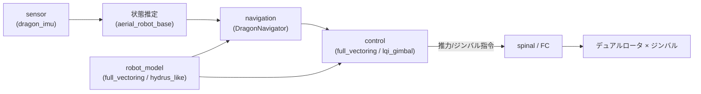

# DRAGON ドキュメント

**DRAGON** = *Dual-Rotor-Embedded Multilink Robot with the Ability of
Multi-Degree-of-Freedom Aerial Transformation*

各リンクに二重ロータ（ジンバル付きデュアルロータ）を搭載した**多リンク空中変形ロボット**です。
飛行中に関節を曲げて形状を変え、力・トルクを全方向に発生できます。

## 目次

| # | ドキュメント | 内容 |
| --- | --- | --- |
| 01 | [システム概要](01_overview.md) | ソフトウェア構成・主要モジュール |
| 02 | [ロボットモデル](02_robot_model.md) | リンク/ロータ/ジンバル構造・2 つのモデル |
| 03 | [制御](03_control.md) | LQI ジンバル制御 / フルベクタリング制御 |
| 04 | [ナビゲーション](04_navigation.md) | フライトステート・姿勢/変形処理 |
| 05 | [起動方法と設定](05_bringup_config.md) | launch 引数・設定ディレクトリ |

## モジュール全体像

## 関連論文

- M. Zhao, T. Anzai, F. Shi, X. Chen, K. Okada and M. Inaba,
  "Design, Modeling, and Control of an Aerial Robot DRAGON," *IEEE RA-L*, vol. 3,
  no. 2, pp. 1176-1183, 2018.
